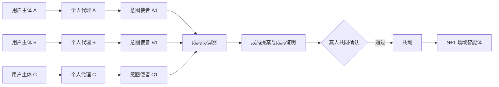

# 共域 CoField · 产品设计

- 状态：产品方向与边界已确认
- 定位：以**共同事件**为核心的校园社交连接器
- 首个高密度场景：项目、比赛、科研与共同创作组队
- 外部约束来源见 [`01-赛题理解`](./01-赛题理解.md)；实现方式见 [`03-技术架构`](./03-技术架构.md)；权利与安全见 [`04-治理与安全`](./04-治理与安全.md)；理论与文献见 [`05-研究依据与评审`](./05-研究依据与评审.md)；词汇与不变量见 [`CONTEXT.md`](../CONTEXT.md)

---

## 1. 一句话与一条链

共域不是校园通讯录、校园墙、陌生人卡片推荐，也不是让两个数字分身替真人交朋友。它解决的是：

> 当一个学生只有"此刻想做什么"，却没有完整资料、现成关系和主动破冰能力时，系统如何把模糊意图变成可回应的行动条件，找到一个真正能成事的小组；又如何在所有真人确认后，把这次行动变成多人共同拥有的空间和下一次连接的可信依据。

价值链自始至终只有一条：

```text
当下意图
→ 可回应的匹配信封
→ 可行动的成局提案
→ 受限的 Agent 协商
→ 真人共同承诺
→ 共同事件与共域
→ 行动证据与共同回声
→ 可撤销的记忆切面
→ 更好的下一次成局
```

一句话定位：

> 不是推荐一个人，而是形成一个能够一起完成事情的最小共同体；不是保存一次活动，而是让行动留下一个会继续生长的共同地方。

---

## 2. 为什么是"项目组队"作为首个楔子

项目、比赛、科研和共同创作具备五个适合建立闭环的属性：

1. 有明确目标和截止时间；
2. 需要角色与能力互补，而非单纯兴趣相似；
3. 存在可表达的时间、地点、署名、公开范围等硬边界；
4. 有作品、提交物、任务结果等可验证行动证据；
5. 能自然引发第二次合作、能力交换或持续共同体。

户外活动、城市探索、学习搭子和志愿活动复用同一领域模型，但采用不同风险模板和安全策略（见 [`04-治理与安全`](./04-治理与安全.md) 线下风险分层）。

---

## 3. 北极星与七条原则

### 3.1 北极星

**规模北极星**：每个活跃校园每周**已完成且存在合规完成证据**的共同事件数。

**质量伴随指标**：首次参与者在限定窗口内发起或加入**第二次自愿共同动作**的比例。

两者必须同时看。只用第二次互动比例，可以通过缩小分母造出虚假改善；只用完成数，会退化成刷量。合规完成证据可以是成员确认的任务完成、作品提交或组织者验收，**不要求用户批准行动回声或长期记忆**——记忆是可选体验，拒绝它不能影响事件完成状态或未来匹配资格。

### 3.2 七条原则

1. **意图优先于画像**：先问此刻要完成什么，再按需调用历史；不要求注册时解释完整的自己。
2. **组队优先于相似**：目标是角色完整、约束可行、互惠平衡的小组，而非最相似的两个人。
3. **真人拥有关系权**：Agent 不自动披露、邀约、接受、承诺、建群或发布共同记忆。
4. **事件优先于聊天**：聊天只是协调媒介，共同事件才是关系和长期记忆的来源。
5. **证据优先于推断**：能力与可靠性来自经确认的行动证据，不来自无来源的人格判断。
6. **共同所有优先于平台占有**：共域和共享记忆由参与者共同约束，可见、可撤销、可导出。
7. **可解释优先于神秘分数**：展示满足的条件、证据和风险，不制造"灵魂队友"式幻觉。

### 3.3 明确不成为

- 不成为公共信息流、校园通讯录或无限滑卡产品；
- 不预测谁会成为朋友，不贴永久人格或熟悉度标签；
- 不让 Agent 在用户不知情时开展开放式社交；
- 不以聊天量、连续签到、养成时长代表关系质量；
- 不把私聊、完整课表、实时位置或私人联系方式默认纳入匹配；
- 不以付费改变自然匹配顺序或出售隐私画像；
- 不把 A2A、向量库、图数据库或某个 Agent 框架误当成产品本体。

---

## 4. 参与者与承诺

| 参与者 | 核心任务 | 最害怕的失败 | 产品承诺 |
|---|---|---|---|
| 发起者 | 把模糊想法变成能成事的队伍 | 无人回应、遇到不靠谱的人、解释成本过高 | 低负担表达、可解释成局、清楚的下一步 |
| 候选参与者 | 判断是否值得加入并保护边界 | 被骚扰、过度披露、加入后价值不对等 | 最小披露、条件响应、体面拒绝、明确互惠 |
| 组织者 | 为比赛、课程、社团、实验室形成多个小组 | 供需失衡、热门者被挤兑、过程不可追踪 | 结构化需求池、公平分配、成局与完成度洞察 |
| 已成局成员 | 协调行动并共同留下成果 | 群聊沉没、责任不清、AI 喧宾夺主 | 空间化协作、场域智能体、共同行动回声 |
| 校园运营与安全 | 维护真实身份、处理风险与申诉 | 冒用身份、线下伤害、算法歧视、证据失控 | 分级风控、审计链、撤销与申诉工具 |
| 外部工具/Agent 方 | 在明确权限下提供能力 | 协议耦合、权限越界、数据责任不清 | 标准 A2A/MCP 边界、能力清单、最小授权 |

### 4.1 角色关系



个人代理长期存在，私有记忆不自动外流；意图使者短期存在，只能在授权范围内参与本次成局；场域智能体只在共同事件成立后存在，属于共域。

---

## 5. 三个标志性机制

### 5.1 成局证明：从"相关"升级到"能行动"

回答五个问题：

1. **为什么是这几个人？** 角色、能力和资源如何覆盖目标。
2. **为什么是现在？** 时间、地点、截止期限是否相交。
3. **为什么对每个人都有价值？** 每人的贡献与获得是否基本平衡。
4. **证据从哪来？** 当前自述或已获准的历史行动证据。
5. **还有什么不能替人决定？** 哪些红线、署名、公开范围或线下边界待确认。

```text
目标：周五前完成一支 60 秒校园流浪猫短片

可成局依据
✓ 角色覆盖：策划、拍摄、剪辑
✓ 时间交集：周三 19:00–21:30，周四 14:00–18:00
✓ 地点可行：三人均授权显示"可到东校区"
✓ 经历证据：剪辑候选有两次已确认短片交付记录
✓ 互惠价值：策划获得作品，摄影练习叙事拍摄，剪辑获得署名素材
✓ 组内稳定：在当前候选池中，没有成员存在更偏好且愿接纳他的其他小组

需要真人决定
△ 是否公开发布以及发布平台
△ 署名顺序与素材二次使用范围
△ 是否允许出现人物正脸

不确定性
△ 摄影候选没有夜景项目证据，当前依据来自本人本次自述
```

注意倒数第二条"**组内稳定**"：它来自 hedonic coalition game 的稳定性检查（见 [`03-技术架构`](./03-技术架构.md) §8.6），是一个比"92% 匹配度"有意义得多、且可验证的承诺。

系统禁止把不同维度压缩成一个无法检查的总分。内部可以有排序分，界面必须展示构成因素、来源和约束。

### 5.2 N+1 共域：共享 Agent 属于事件，而非某个人

**为什么必须是 N+1 而不是 2+1** —— 这不是产品偏好，是数学结构决定的：

一个事件涉及 N 个人，正确的数学对象是**超边（hyperedge）**，不是若干条两两相连的边。文献明确：高阶交互一般不可约化为成对交互。

> 抖音小火人把关系建模成一条 pairwise 边，精灵挂在边上，所以 5 个朋友必须养 5 只、且不支持 3+1。**从 pairwise graph 升级到 hypergraph，就是 2+1 → N+1 的数学表达。**

匹配完成前，个人意图使者只交换受限结构化信息；确认完成后它们结束任务。系统随后创建 N 名真人共同拥有的共域，并生成场域智能体。

场域智能体**能做**：

- **协调**：把已确认目标转为任务、时间线、待办和提醒草稿
- **维护边界**：标示哪些信息可见、哪些决定需要谁重新确认
- **整理证据**：接收作品、图片、链接和任务结果，保留来源
- **提出延续**：在成员主动触发时，基于未完成事项提出下一次行动种子

**不能做**：

- 读取任一成员未共享的私有记忆
- 替成员修改角色、署名、时间或公开边界
- 主动把共域内容带到另一个共域
- 以任何成员口吻对外发送消息
- 将未批准的推断发布为共同记忆

### 5.3 行动回声：空间状态证明关系发生过

共域不是事件结束即沉没的群聊，它随阶段改变形态：

| 阶段 | 空间中的核心对象 | 场域智能体的存在方式 |
|---|---|---|
| 种子 | 共同目标、成员席位、角色、红线 | 解释成局依据，提示未确认项 |
| 筹备 | 时间线、任务、素材位、风险与依赖 | 协调草稿、冲突提示、提醒 |
| 行动 | 现场素材、任务进度、变更记录 | 按需帮助，不抢占主界面 |
| 回声审阅 | 作品、关键瞬间、贡献、复盘草稿 | 聚合证据并请求相关人确认 |
| 记忆发布 | 经确认的共同故事与记忆切面 | 解释来源、用途、有效期 |
| 延续 | 下一次行动种子、重复协作线索 | 仅在成员主动唤起时参与 |

**空间只因行动证据生长，不因聊天量、签到、装扮消费或 Agent 对话轮数生长。**

---

## 6. 完整用户旅程

### 6.1 意图产生：不要求先做完整自我介绍

用户输入：

> 我想做一个关于校园流浪猫的一分钟短片，周五前完成。我会写脚本，但不认识会拍摄和剪辑的人。

AI 编译为用户可检查的意图：

```yaml
goal: 周五前完成 60 秒校园流浪猫短片
offers: [脚本与策划]
needs: [拍摄, 剪辑]
time_window: 周三至周五
location_scope: 校内，具体校区待确认
team_size: 3-4
boundaries: [人物正脸需另行确认]
open_questions: [是否公开发布, 署名规则]
```

AI 只追问一到两个**会改变可行空间**的问题（"你能到哪个校区？""必须周五前发布，还是完成初稿即可？"），不追问性格、MBTI 或完整履历。

### 6.2 授权：生成匹配信封

用户逐项确认本次可以使用与披露的信息：当前目标/供给/需求/时间、粗粒度地点、协作与安全边界、可选作品链接、允许引用的历史切面。每项都带用途、接收范围和有效期，可选"只用于平台求解，不向候选展示"。

### 6.3 撮合：按窗口清算，而不是即时撮合

平台先用硬约束和权限策略缩小候选集，再做语义与图召回，最后由约束求解器生成小组——**而不是让所有 Agent 两两对话**。

**撮合节奏采用固定窗口而非即时撮合**，这是有理论依据的选择（Akbarpour–Li–Oveis Gharan, JPE 2020）：当平台能识别参与者何时离开市场时，等待以增厚市场的收益很高，且比提高撮合速度更重要。而我们的意图**自带 deadline**——用户主动告诉了我们他什么时候退出。详见 [`03-技术架构`](./03-技术架构.md) §8.7。

对 deadline 临近的成员单独提前清算。用户收到少量高质量提案，每个都带成局证明、待决定事项和失效时间。

### 6.4 受限协商：Agent 先把可比较的问题讲清楚

候选个人代理可以返回：时间是否可行、某项能力证据是否允许被引用、接受需要满足的条件、哪个字段拒绝披露、哪些冲突必须交给真人。

**代理不能闲聊、不能代替用户"聊出感情"、不能给出最终接受。** 协商结果是一份结构化差异清单，不是一段供人观赏的 Agent 对话。

### 6.5 真人会晤：确认边界与行动

提案达到"可讨论"状态后，真人进入低压力确认界面：查看共同目标和每人角色 → 只讨论未解决事项 → 选择接受/条件接受/修改/体面拒绝 → 明确第一个小行动（"周三 19:00 线上看脚本"）。

提案任一实质字段变更后，受影响成员需重新确认。达到确认门槛后，系统才**原子化**创建共同事件和共域。

### 6.6 行动与回流：让事实而非话术成为记忆

1. 成员或外部工具回传作品、照片、文档、提交链接或任务状态；
2. 场域智能体根据证据生成行动回声**草稿**；
3. 涉及个人贡献、能力或关系的表述由相关人员**逐项确认**；
4. 获准内容形成记忆切面和共同行动边；
5. 用户未来发起相关意图时，系统按权限检索这些切面；
6. 高重叠成员多次行动后，系统**提出**"是否形成持续共同体"，但不自动建群。

---

## 7. 共域：把协作界面做成关系资产

### 7.1 "空间感"不是 3D，而是关系可见

空间感的本质不是建模虚拟校园，而是让用户一眼看见：我们共同要完成什么、谁承担什么角色、现在卡在哪里、哪些东西由我们共同创造、这次留下了什么、下一次为什么还值得回来。

因此共域采用**结构化空间画布**而非聊天记录作为主界面。聊天、评论和通知可以存在，但退居对象旁边。

### 7.2 空间对象

| 对象 | 生命周期 | 权限特点 |
|---|---|---|
| 目标核 | 从成局提案继承，可版本化 | 实质修改需相关成员重新确认 |
| 成员席位 | 角色、贡献、获得、边界 | 只能由本人或治理规则修改 |
| 任务与里程碑 | 筹备至完成 | 可分配、认领、评论和留证 |
| 决策门 | 署名、公开、时间等待确认项 | 明确需要谁确认，不能被 AI 越过 |
| 素材卡 | 图片、文档、链接、提交物 | 带来源、许可和可见范围 |
| 行动轨迹 | 状态变更与关键节点 | 来自领域事件，不等于监控用户 |
| 回声卡 | 共同故事、成果、贡献与复盘 | 默认草稿，多方确认后发布 |
| 下一步种子 | 延续行动建议 | 由成员主动启用，不自动骚扰 |

### 7.3 行动回调

行动证据不应只依赖用户手动复述。共域通过 MCP 工具、Webhook 和文件接入连接已有工作流：GitHub（Issue/PR/Commit/Release）、Figma（文件/评论/版本）、日历（经授权的事件状态，不读完整私人日历）、文档与云盘、比赛/课程平台、相机上传、地图签到（仅适用场景，粗粒度短时多方同意）。

外部回调首先成为"待核实证据"，经来源验证和成员确认后才影响记忆或关系投影。**没有工具接入时，核心流程仍可通过人工上传与确认工作。**

### 7.4 场域智能体的能力模型

不是无限工具权限的超级 Agent，而是能力令牌驱动的组合：

```text
允许：read_shared_goal / read_approved_space_objects / draft_plan /
      draft_reminder / request_member_decision / ingest_external_artifact /
      draft_action_echo / propose_memory_facets / suggest_next_action

永远需要真人或共域治理规则：
      change_commitment / invite_or_remove_member / publish_artifact /
      share_outside_space / approve_memory / spend_money / book_or_cancel
```

### 7.5 从一次事件到持续共同体

同一批成员多次完成事件后，共域出现"持续共同体候选"：系统说明依据（共同完成次数、角色延续、下一步需求）→ 成员选择是否建立 → 共同体拥有自己的目标、成员规则和可见范围 → **每次新行动仍创建独立共同事件**，保留清晰的同意和证据边界。

共同体不是无限共享私有记忆的容器。

---

## 8. 自我管理面：主页是控制台，不是展示位

### 8.1 两种"主页"必须分开

| | 对外展示面 | 自我管理面 |
|---|---|---|
| 谁看 | 别人 | 只有自己 |
| 作用 | 让别人浏览、评估、决定加不加你 | 让你看见并控制系统对你的记录 |
| 是否做 | **不做** | **必须做** |

不做对外展示面的理由：一旦存在可浏览的档案卡，产品就退回"看人卡决定要不要连接"，冷启动用户天然吃亏，且违反"意图优先于画像"。

**别人永远只能看到"针对某一次成局、经你授权的那个切片"，看不到你的主页。**

但自我管理面是刚需——[`04-治理与安全`](./04-治理与安全.md) §5.1 要求"用户能查看系统记住了什么、为什么、谁能看、用于什么"，这条本身就要求一个界面来承载。

因此产品面共 7 个：

```
① 意图面      说一句想做什么
② 提案面      2–3 个带证明的提案
③ 共域面      确认后的行动空间
④ 回声面      结束时决定留下什么
─────────────────────────────────
⑤ 我的事件    池塘索引
⑥ 我的记忆    切面管理
⑦ 我的授权    代理授权与匹配信封
```

### 8.2 我的事件

"人是事件的投影"在界面上的直接体现：

```
进行中 (2)
  校园流浪猫 60s        周五截止 · 3 人 · 你是策划      →
  社团招新短片          筹备中 · 4 人 · 你是脚本        →

已完成 (1)
  《檐下》              2026-08-15 · 三人并列署名       →
  └ 产出 1 件作品，形成 2 条记忆切面

已取消 (1)
  夜爬拍星轨            因天气终止 · 未产生关系记忆
```

取消的事件在这里可见（属于本人真实经历），但**不产生关系边、不产生成功记忆**。诚实展示，不粉饰。

### 8.3 我的记忆

这一面是"关系资产"最硬的证据，也是权利落地的地方：

```
┌─────────────────────────────────────────────────┐
│ 「完成 60 秒纪录短片的剪辑与调色」               │
│ 来源   《檐下》· 成片 v3 / 工程文件 / 三人确认    │
│ 谁能看  参与过共同事件的人 · 成局证明中可摘要引用 │
│ 用于    创作类组队匹配                           │
│ 有效期  至 2027-08-15（到期需复核）              │
│ 状态    ● 已确认                                 │
│ [ 编辑措辞 ] [ 停止用于匹配 ] [ 撤销 ] [ 导出 ]  │
└─────────────────────────────────────────────────┘

┌─────────────────────────────────────────────────┐
│ 「三人曾在时间紧张下完成一次完整创作交付」        │
│ ⚠ 关系切面 · 涉及 你 / 陈牧 / 苏晚                │
│ 撤销会通知另外两人，因为这条描述的是你们三个      │
└─────────────────────────────────────────────────┘

┌─────────────────────────────────────────────────┐
│ 「擅长夜景构图」                                 │
│ ○ AI 草稿 · 未确认 · 不参与任何匹配              │
│ [ 我确认 ] [ 改写 ] [ 删掉 ]                     │
└─────────────────────────────────────────────────┘
```

三个界面要素对应三条不变量：AI 草稿与已确认必须一眼可辨；关系切面撤销要提示会影响他人；每条都能追到具体事件与素材。

### 8.4 我的授权

列出仍在生效的代理授权与匹配信封，每项显示目的、字段、对象、有效期，支持**一键撤销**。撤销立即阻止新用途，派生索引异步清理（SLA 见 [`03-技术架构`](./03-技术架构.md) §14.5）。

### 8.5 "别人眼中的我"预览

```
[ 预览：在一次创作组队的成局证明里，别人会看到我的什么 ]

  → 角色需求匹配：脚本 / 策划
  → 经历证据：1 次已确认创作交付（可摘要引用）
  → 时间交集：仅显示与对方的重叠区间
  → 不会看到：院系、年级、其他事件、未授权切面
```

**这让"最小披露"从一条原则变成一个用户可以自己检查的东西。**

### 8.6 对架构的影响：接近于零

这三个面全部是**读模型 + 已有的授权/撤销命令**，领域模型不改。切面表本来就有 `visibility` / `matching_allowed` / `approval_state` / `valid_time` 与撤销传播，主页只是把它们渲染出来。

这是"前端可替换"设计的第一次回报：加三个界面，后端只需增加查询端点。

---

## 9. 冷启动、流动性与增长

### 9.1 供给先行，而不是先造一个空社交广场

最稳定的冷启动供给来自**已有真实需求和负责人**：赛事与黑客松的角色席位、课程项目与跨专业作业、实验室与导师项目、社团活动与校园媒体、创作者协作、"本周五前需要 X"的短周期机会。

组织者发布结构化**行动机会**（目标、成功条件、席位、资格、期限、负责人、边界）；学生发布自己的短期意图。成局协调器在两侧之间求解，也可把多个兼容的学生意图聚合为机会，但**事件成立前必须指定真人负责人**。

### 9.2 流动性监控

每个市场单元持续监控：每个必要席位的合格候选深度、意图到首个可行提案的时间、可行小组生成率与提案填满率、多方接受率/首次行动率/完成率、角色缺口与热门候选拥挤、新老用户成局差距、单个组织者的取消与争议。

流动性不足时按顺序处理：候补池 → 延长撮合窗口 → 聚合相似需求 → 角色缺口广播 → 可解释地请求放宽非安全约束 → 引入验证组织供给。**未经同意不自动扩大到其他校园或披露更多身份。**

### 9.3 三个留存循环

```text
参与者：完成事件 → 获得可控经历证据 → 下次更容易被合适机会看见
组织者：创建机会 → 成局与执行 → 复用席位模板、风险规则与运营洞察
共同体：共同完成 → 行动回声 → 下一次种子 → 多次事件 → 主动形成持续共同体
```

三个循环都依赖真实行动，不依赖信息流成瘾或 Agent 陪伴时长。

### 9.4 分发机制

机会页、课程页、社团页、比赛页是主要入口。内容可以成为意图触发器（一个短片启发"我也想拍"），但后续进入结构化成局。分享卡展示目标和缺口，不泄露候选私人信息。通知围绕明确状态和下一步，不用"有人很适合你"制造焦虑。**不建设无限滚动的公共人卡 feed。**

---

## 10. 组织者产品与商业模型

### 10.1 组织者工作台

组织者不是管理员配角，而是高质量行动供给的关键角色。工作台提供：机会模板/席位/资格/风险规则、候补与补位与改期与负责人移交、多团队并行成局与公平分配、只展示必要且获准的候选信息、完成与缺口与干预与争议洞察、重复项目与持续共同体管理、组织 SSO 与数据保留策略。

角色是**事件级权限**：同一名学生可以在一个事件中是组织者，在另一个事件中是普通参与者。

### 10.2 可持续商业模型

B2B2C：

- 学生的核心表达、成局、共域和数据权利**免费**；
- 院系、实验室、社团、赛事方为组织工作台、重复项目编排、资格接入、治理、分析和 SLA 付费；
- 特定项目可收透明服务费，但**不能购买自然匹配排名**；
- 不出售个人记忆、不用广告改变成局、不允许"热门用户付费优先"。

商业化必须加强可信行动供给和组织效率，不能破坏成局证明的中立性。

### 10.3 运营责任

系统不是纯算法自运行市场。校园运营负责：验证组织与高风险机会、监测供需流动性、处理举报申诉与线下事故、维护机会模板与场景安全规则、干预异常取消与剥削性招募与曝光集中、与校园心理/保卫/法律/学工体系建立升级路径。

---

## 11. 指标体系与实验

### 11.1 指标树

| 维度 | 关键指标 |
|---|---|
| 意图质量 | 结构化完成率、用户修正率、追问数、撤回率 |
| 流动性 | 合格池深度、可行提案率、首提案时间、缺口席位 |
| 匹配 | 多方接受率、填满率、证明查看/修改率、条件响应率 |
| 稳定性 | 成局后至首次行动前的退出率、稳定性检查未通过重解率 |
| 执行 | 首次行动率、完成率、缺席率、阻塞恢复率、负责人移交率 |
| 回声 | 素材贡献率、回声确认率、切面批准/撤销率 |
| 留存 | 再次行动率、组织者重复发起率、持续共同体复发率 |
| 公平 | 新老用户成局差距、曝光集中度、跨圈层机会、重复拒绝率 |
| 安全 | 举报率、确认伤害率、屏蔽后触达率、申诉纠正率 |
| 经济 | 每次提案/成局/完成事件成本、AI 成本、人工干预率 |

所有指标按校园、行动类别、组织者类型、新老用户、风险级别做 cohort 分析。**增长指标不能脱离完成质量、安全和公平指标单独优化。**

### 11.2 学习信号强度

```text
查看提案 < 条件响应 < 真人接受 < 首次行动
< 事件完成 < 行动回声确认 < 第二次自愿行动
```

模型训练优先使用后半段强信号。拒绝、取消和未完成需要上下文，不能简单等价为"某人不靠谱"——必须区分时间冲突、目标改变、团队缺口、安全退出和真实违约。

### 11.3 核心实验

| 假设 | 实验 | 成功判断 |
|---|---|---|
| 成局证明优于匹配百分比 | 对比两种提案解释 | 接受质量、修改率、完成率提升，而非只提高点击 |
| 少量高质量提案优于无限列表 | 2–3 个提案 vs 长列表 | 决策时间降低、完成率不降、曝光更公平 |
| 意图优先能保护冷启动 | 隐藏/显示历史信号 | 新用户成局差距缩小且总体完成率稳定 |
| 窗口撮合优于即时撮合 | 固定窗口 vs 即时 | 可行提案率与完成率提升，等待成本可接受 |
| 稳定性检查降低散架率 | 有/无稳定性校验 | 成局后至首次行动前退出率下降 |
| 空间对象优于群聊承接 | 共域 vs 纯群聊 | 首次行动、阻塞恢复、回声确认提升 |
| 行动回声促成延续 | 有/无下一步种子 | 第二次自愿行动提升且通知投诉不增 |
| 受限协商减少认知负担 | 人工全聊 vs 结构化预热 | 真人需讨论的问题减少，但信任感不降低 |

---

## 12. 差异化与关键取舍

### 12.1 与常见方案的对照

| 常见方案 | 共域 |
|---|---|
| 用 AI 生成更完整的人设 | 用 AI 编译当下可回应意图 |
| 推荐相似的人 | 求解可行动、互惠**且稳定**的小组 |
| 展示匹配百分比 | 展示成局证明与待真人决定项 |
| 两个 Agent 自由聊天 | 目的、字段、轮次受限的协商 |
| 匹配成功后建群 | 真人确认后创建共同事件与空间 |
| 群机器人服务所有人 | 由成员共同拥有、事件边界明确的 N+1 场域智能体 |
| 保存聊天摘要 | 从真实行动证据形成可撤销记忆切面 |
| 用活跃度证明关系 | 用共同完成和再次自愿行动证明关系生长 |

### 12.2 关键取舍

| 决策 | 选择 | 放弃的方案 | 原因 |
|---|---|---|---|
| 社交基本单位 | 共同事件/临时共同体 | 个人资料卡 | 冷启动友好，能验证真实关系发生 |
| 关系的数学对象 | 超边 | 两两边 | 高阶交互不可约化为成对交互；这是 N+1 的根据 |
| 首个楔子 | 项目、比赛、科研、创作组队 | 泛陌生人交友 | 目标、约束、成果与互惠更清楚 |
| 匹配目标 | 群体可行性 + 互惠 + **稳定性** | 两人相似度 | 最优解未必稳定，不稳定的组会自己散架 |
| 撮合节奏 | 固定窗口清算 | 即时撮合 | deadline 可识别时，增厚市场的收益高于提速 |
| Agent 模式 | 第一方受限任务；跨信任边界用 A2A | 开放式 Agent 闲聊 | 降低越权、成本与虚假社交 |
| 人机权力 | Agent 草拟，人类决定 | 自动披露/接受/承诺 | 关系权必须归真人 |
| 权威存储 | Postgres + 事件账本 | 向量/图/Agent memory | 同意、事务、删除和审计可控 |
| 图谱 | 共同事件的派生超图，留在 Postgres 内 | 独立图数据库 | 查询是浅层的；引入即打破单一权威 |
| 空间 | 结构化行动画布 | 3D 世界或纯群聊 | 空间感来自共同状态，不靠视觉噱头 |
| 学习策略 | 规则/求解起步，结果充分后学习排序 | 冷启动即黑箱 ML | 可解释、公平、避免伪标签 |
| 开源策略 | 适配成熟上游，仅自研差异化岛屿 | 从零搭基础设施 | 降低风险并保持可替换性 |

### 12.3 护城河

不是某个 LLM、Agent 框架或向量库，而是：

- 从意图、约束、提案、条件响应、承诺到完成的**完整结果链**；
- "为什么成局"与"后来是否完成"之间的**因果反馈**；
- 本地校园组织者网络和高密度真实行动供给；
- 可复用的机会模板、席位模型、风险策略和共域对象；
- 经用户控制、可追溯、可撤销的关系记忆所建立的信任。

---

## 13. 已锁定的产品决定

- 服务的是"从陌生或弱连接到共同行动，再到可延续同伴关系"的阶段；
- 首个高密度场景是项目、比赛、科研与共同创作组队；
- 用户无需以完整长期画像作为冷启动前提；
- 匹配前的权威对象是意图与成局提案，确认后是共同事件与共域；
- 系统优化**可行动且稳定的共同体**，而非个人相似度；
- 撮合采用窗口清算，deadline 临近者提前处理；
- AI 可抽取、检索、比较、草拟和协调，但不能披露、接受、承诺或批准共享记忆；
- N+1 场域智能体在真人确认后诞生，属于共域，不继承成员私有记忆；
- 长期记忆是事件图上的有来源切面，而非不断增长的个人 Markdown；
- 共域只因真实行动证据生长；
- Postgres 和领域事件是权威，向量、图、搜索与 Agent memory 都是派生能力；
- 开源复用是开发红线；
- 真实用户运营优先限定 18 岁以上；覆盖未成年人前必须完成独立设计；
- 产品面向完整可扩展系统，不以临时交付范围限制长期边界。

---

## 14. 产品有效性验收

1. 零历史用户仅凭一次意图可以获得可行、互惠的小组提案；
2. 成局证明能被普通用户理解，并能指出真实待决定项；
3. Agent 预热减少真人重复沟通，但**不降低真人接管率**；
4. 成局后大多数事件产生明确的第一步行动；
5. 通过稳定性检查的组，成局后至首次行动前的退出率显著低于未通过的组；
6. 共域比纯群聊更好地支持执行、恢复和成果沉淀；
7. 行动回声能提高下一次相关成局质量，而不制造隐私不适；
8. 持续共同体来自重复自愿行动，而非系统强推关系。

---

## 附录：赛事呈现建议（不构成产品需求）

评审表达可围绕三个连续画面，但**实现团队不得把这些画面反推为长期产品边界**：

1. **头部**：用户只表达一次当前意图，系统形成包含角色、证据、互惠、稳定性和红线的成局证明；
2. **转折**：意图使者完成任务，真人确认后 N+1 共域诞生，AI 明确变成共同拥有的场域角色；
3. **尾部**：同一个空间因真实作品和行动证据改变，并展示获准的回声如何帮助下一次成局。

这三幅画面用于说明"看见—回应—行动—记忆"的产品逻辑，不代表可以省略身份、同意、恢复、安全、撤销和规模化能力。
