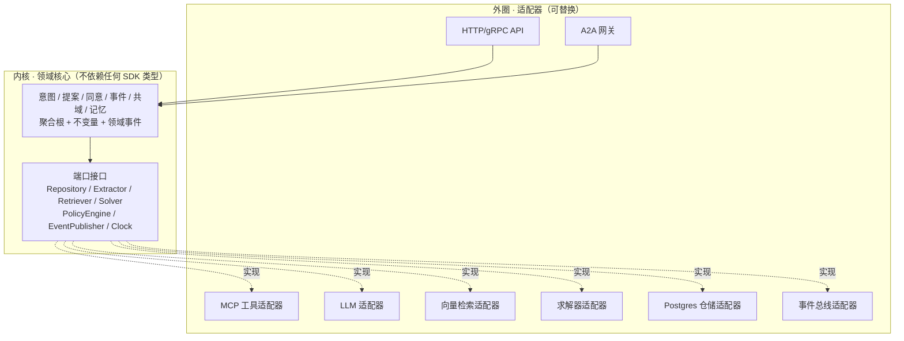
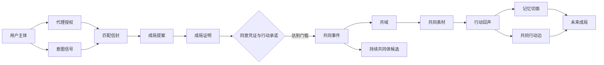
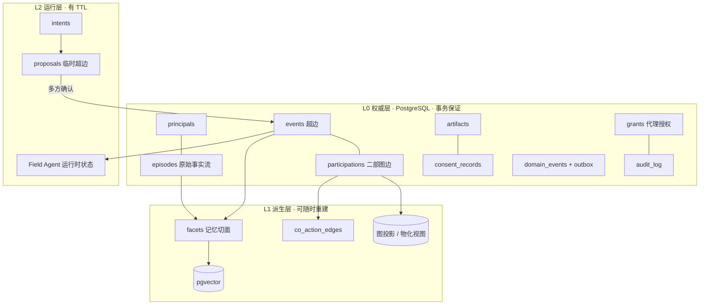
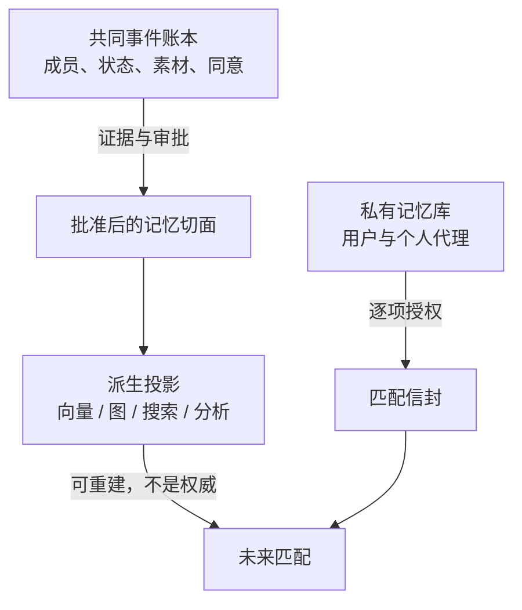
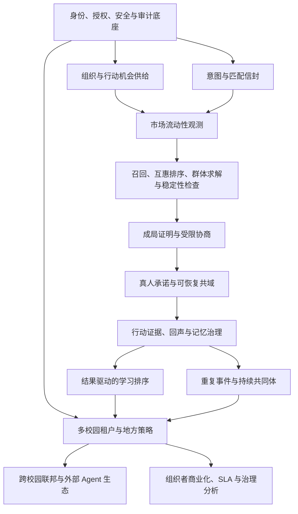

# 共域 CoField · 技术架构

- 面向：生产级、可扩展、可长期演进的后端系统
- 前端假设：**存在多个、可替换的前端**（Web、移动端、小程序、组织者工作台、Agent 客户端）。架构不为任何一个前端做特殊设计。
- 工程红线：**复用优先，不重复造轮子**
- 产品语义见 [`02-产品设计`](./02-产品设计.md)；权利与安全见 [`04-治理与安全`](./04-治理与安全.md)；理论与文献见 [`05-研究依据与评审`](./05-研究依据与评审.md)

---

## 1. 架构目标与推论

| 目标 | 推论 |
|---|---|
| 后端是产品本体，前端可替换 | 所有状态必须能通过版本化 API 完整获取；实时通道只是增强 |
| 新场景可加入而不改核心 | 场景差异必须落在**注册表配置**里，不能落在 `if kind == 'hiking'` 分支里 |
| 组件可替换 | 领域核心不依赖任何 SDK 类型；LLM、向量、Agent 框架都在适配器后面 |
| 同意与删除必须可靠 | 权威事实单一来源；所有派生物可重建可失效 |
| 复用优先 | 只自研四个差异化岛屿，其余必须评估成熟上游 |

---

## 2. 复用优先：自研边界

### 2.1 只自研四个差异化岛屿

1. 意图、机会、授权与成局的**领域协议**；
2. **互惠小组求解 + 稳定性检查 + 成局证明**；
3. 共域的**行动状态、N+1 权限与行动回声**；
4. 从真实行动结果反馈下一次匹配的**学习闭环**。

### 2.2 其余一律先找上游

认证、数据库、对象存储、实时通信、协作编辑、工作流引擎、策略引擎、结构化输出、约束求解、可观测性、病毒扫描、Agent 协议、工具协议——**原则上不得从零自研**。

新增基础设施必须提交：上游项目与可替代候选、许可证及商业兼容性、维护活跃度与安全记录、数据导出与退出路径、与领域核心的隔离方式、升级回滚与 SBOM 责任人。

默认"适配上游"而非 fork。必须 fork 时保留上游来源、同步策略、差异补丁和许可证清单。

### 2.3 判定规则：什么时候允许自己写

```
这段逻辑是否编码了"共域独有的产品判断"？
  ├─ 是 → 自研（属于四个岛屿）
  └─ 否 → 它是否有成熟上游？
           ├─ 有 → 适配上游，写适配器不写实现
           └─ 无 → 先怀疑是不是问题定义错了；确认无误后自研，并把它做成可替换的适配器
```

**反例澄清**：`facets` 表的生命周期与审批逻辑是自研的，但这不违反红线——它属于岛屿 3，且任何 OSS 记忆框架都不提供"多主体审批 + 撤销传播"（见 §12.3 对 Mem0 的排除理由）。而 PostgreSQL 的时序约束、JSON 校验、行级安全全部直接用，不自己实现。

---

## 3. 底层逻辑与理论基础

> **系统里没有"用户档案"这个对象。只有事件，和从事件投影出来的人与关系。**

四条不变量：

1. **事件是一等公民，人是事件的投影。** 人-人关系不存储，按需从共享超边计算。
2. **意图不是画像的降级版，是另一类对象。** 画像回答"我是谁"，意图回答"我现在想和谁一起做什么"。
3. **权威事实与派生索引严格分离。**
4. **熟不熟是算出来的，不是存出来的。**

三个可引用的成熟结论（详见 [`05-研究依据与评审`](./05-研究依据与评审.md)）：

- **Breiger (1974) 人与群体的二重性**：人-人网络与群-群网络都是同一个"人-群"二部图的投影。这就是"人是事件的投影"的学术表述。
- **超图**：一个事件涉及 N 人 → 超边，不是若干条两两边。高阶交互一般不可约化为成对交互。**这是 2+1 → N+1 的数学根据。**
- **EBSN（KDD 2012）**：G = ⟨U, A_on, A_off⟩，同时含线上与线下互动的异构网络；实证发现社交互动具有**强局部性**——这是"校园半封闭场域"假设的支撑。

---

## 4. 架构风格：端口-适配器 + 事件驱动

可扩展性的根本保障不是分层图，而是**依赖方向**。



三条硬规则：

1. **领域核心不 import 任何第三方 SDK 的类型。** A2A SDK 的 `Task`、Pydantic-AI 的 `Agent`、OR-Tools 的 `CpModel` 都不得出现在领域层签名里。
2. **换掉一个适配器不应触及领域测试。** 这是"可替换"的可执行定义。
3. **跨服务只通过版本化领域 schema、领域事件或 A2A Artifact 通信，不共享 ORM 实体。**
4. **领域核心不得直接调用 `now()`。** 时间是一个注入的 `Clock` 端口。

技术语言可以分工而不分裂领域：Web/BFF 用 TypeScript，抽取/召回/求解用 Python。跨语言 schema 契约见 §10.4。

### 4.1 Clock 端口

```text
Clock
  ├─ SystemClock      生产
  ├─ SimulatedClock   仿真，可任意快进
  └─ FrozenClock      单元测试
```

意图 TTL、撮合窗口、切面有效期、提案过期、工作流等待，全部走这个端口。

> 这条必须在写领域代码之前定。它现在是一行接口，三个月后是一次跨几十个文件的重构。理由与用法见 [`06-仿真与测试人口`](./06-仿真与测试人口.md) §4.1。

### 4.2 合成主体隔离

```sql
principals.is_synthetic boolean not null default false
```

三条硬约束：合成主体**永远不能与真人进入同一个成局提案**（领域不变量，写进测试）；仿真跑在独立 `campus_id` 上；界面必须可见标记。第三条是治理要求——不能让真人以为自己在跟真人匹配。

---

## 5. 领域模型



### 5.1 聚合根与不变量

| 聚合 | 权威事实 | 关键不变量 |
|---|---|---|
| 意图 | 当前目标、约束、TTL、授权范围 | 可撤回；不能被历史画像覆盖 |
| 成局提案 | 候选成员、角色、版本、条件响应、证明 | 确认前不产生关系；过期后不可提交 |
| 同意 | 谁对哪个版本、什么目的作何决定 | 修改实质字段必须重新确认 |
| 共同事件 | 成员、角色、目标、状态、风险级别 | 达到门槛后才能创建；状态转换可审计 |
| 共域 | 空间成员、对象、场域智能体授权 | 只承载共同授权内容 |
| 素材 | 来源、上传者、许可、可见范围 | 删除或撤销必须传播到派生内容 |
| 记忆切面 | 结构化断言、证据、同意、时效、用途 | 未批准推断只能是草稿 |
| 持续共同体 | 成员规则、共同目的、治理方式 | 必须由成员主动创建，不能由系统推断成立 |

### 5.2 生命周期

```text
意图：  draft → consented → active → matched | withdrawn | expired

提案：  assembling → negotiating → awaiting_humans
        → committed → converted_to_event
        → declined | expired | invalidated

事件：  seed → planning → active → echo_review
        → memory_publish → dormant → collective_candidate
                         ↘ cancelled / archived
```

取消事件保留必要审计，但**不产生"成功协作"记忆**；未完成事件可沉淀经成员确认的中性事实（"项目因时间冲突终止"），但不能自动转化为对人的负面可靠性判断。

### 5.3 人与关系是投影

```text
用户主体
  ├─ 私有记忆库：本人可见，未必可用于匹配
  ├─ 当前意图：短期、目的明确、可过期
  ├─ 共同事件指针：参与过哪些超边
  └─ 记忆切面投影：哪些经确认事实在何种范围内可被使用
```

"熟人"不是标签，而是多个共同事件、重复自愿协作、共同证据和时间衰减的可解释投影：

```text
关系强度 = f(共同确认完成的事件数, 共同产出素材数, 重复自愿协作次数, 时间衰减)
```

该投影可用于召回与解释，**不能替代用户对关系的自我定义**。

---

## 6. 存储架构

### 6.1 三层分工



L1 全部可以删库重建，L0 不行。**这条线一旦模糊，撤回授权时就无法确定要抹掉什么。**

### 6.2 核心表

```sql
-- 超边本体。"池塘"就是这张表的一行。
events(id, campus_id, kind, goal, time_window, place_scope,
       lifecycle, risk_tier, collective_id, created_from_proposal_id)

-- 二部图的边 = 超边的成员集合
event_participations(event_id, principal_id, role,
                     joined_at, left_at, commitment_state)

-- 原始事实流：每条派生事实都要能追溯到这里
episodes(id, event_id, principal_id, kind, payload,
         occurred_at, ingested_at)

-- 长期记忆的唯一形态。不是 markdown。
facets(id, subject_type,          -- person | relationship | collective
       subject_ids[], claim_type, claim,
       source_episode_ids[], evidence_artifact_ids[],
       confidence, visibility, matching_allowed, purpose_scope[],
       approval_state,            -- draft|approved|contested|redacted|withdrawn|superseded
       valid_time  tstzrange,     -- 事实何时成立
       record_time tstzrange,     -- 系统何时知道
       PRIMARY KEY (id, valid_time WITHOUT OVERLAPS))
```

完整数据域清单：

| 数据域 | 关键实体 |
|---|---|
| 身份 | `users`, `identity_verifications`, `devices` |
| 组织 | `organizations`, `organization_memberships` |
| 机会供给 | `action_opportunities`, `opportunity_seats`, `waitlists` |
| 意图 | `intent_signals`, `intent_versions` |
| 授权 | `delegation_grants`, `match_envelopes`, `consent_records` |
| 成局 | `formation_proposals`, `formation_members`, `formation_proofs` |
| 事件 | `events`, `event_participations`, `event_stewards` |
| 共域 | `shared_spaces`, `space_objects`, `space_object_versions` |
| 素材 | `artifacts`, `artifact_versions`, `artifact_approvals` |
| 回声 | `action_echoes`, `echo_claims`, `echo_approvals` |
| 记忆 | `facets`, `facet_approvals`, `facet_revocations`, `provenance_edges` |
| 图投影 | `coaction_hyperedges`, `coaction_edge_projection` |
| Agent | `agent_registrations`, `agent_tasks`, `pending_agent_actions` |
| 安全 | `blocks`, `reports`, `moderation_cases`, `appeals` |
| 策略 | `policy_decisions`, `policy_epochs`, `revocation_jobs`, `model_runs` |
| 账本 | `domain_events`, `outbox_messages` |

### 6.3 双时间：用 PostgreSQL 原生能力，不引第三方

**PostgreSQL 18 已原生支持时序约束**：

- `PRIMARY KEY (id, valid_time WITHOUT OVERLAPS)` —— 同一主体的同一断言不能有重叠有效期，由数据库强制
- `FOREIGN KEY ... PERIOD` —— 被引用行必须在引用行的整个时间段内存在

**限制要说清楚**：PG 18 实现的是 application time（valid time），**不是** system versioning。真正的双时间可选两条路：[`periods` 扩展](https://github.com/xocolatl/periods)（SQL:2011 系统版本化），或一个 `record_time tstzrange` 字段 + 触发器。**后者对本项目完全够用，且不增加依赖。**

含义：切面的时效性、失效而非删除、历史时点查询，**在 Postgres 里就能做，且能被数据库强制**。

### 6.4 图：留在 Postgres 内

我们的图查询形态是**浅层**的：

```text
人 → 事件 → 人            2 跳，找共同参与者
事件 → 人 → 事件          2 跳，找关联事件
人 → 事件 → 人 → 事件     3 跳，跨圈层桥接
```

不需要 PageRank、社区发现或深层遍历。

- **第一选择**：递归 CTE + 物化视图。零新依赖。
- **第二选择**：[Apache AGE](https://age.apache.org/)（Apache-2.0，ASF 顶级项目）——在 Postgres 内提供 openCypher，继承 B-tree/hash/GIN 索引与 ACID，关系表/JSON/图同一事务。业界共识："当图是 PostgreSQL 中心栈的补充时，AGE 是自然选择；当图是重心时才需要 Neo4j。"我们属于前者。
- **默认永不引入 Neo4j / FalkorDB / 独立图数据库**（理由见 §12.3）。

### 6.5 权威与派生：禁止的反向依赖

```text
✗ 以向量库里"搜得到"证明用户已同意
✗ 以图数据库里有边证明共同事件已确认
✗ 以 Agent memory 里记住某事证明事实仍有效
✗ 以实时广播成功证明空间对象已持久化
✗ 让分析仓库反写权威关系状态
```

---

## 7. 记忆架构

### 7.1 四层



### 7.2 "长期记忆是指针不是文档"

准确表述：**没有"我的档案"这个可读对象，只有"针对本次意图、此刻允许被看到的我的切片"。**

档案 = 一次带三重过滤的查询：

```sql
WHERE 与当前意图语义相关
  AND matching_allowed
  AND now() <@ valid_time
  AND approval_state = 'approved'
```

结果：档案不是文档而是查询结果；切面总量可持续增长，但"当前有效且可用"的集合始终很小。

### 7.3 多主体同意规则

| 使用方式 | 最低确认规则 |
|---|---|
| 本人退出、屏蔽、安全举报 | 单方立即生效 |
| 某人的能力/贡献用于未来匹配 | 该本人明确同意 |
| 描述多人共同关系的切面 | 所有被描述者同意，或适用已明确接受的共域治理规则 |
| 对外发布含可识别人物的素材 | 权利人及所有可识别主体确认 |
| 添加/替换成员、改变公开范围 | 所有受影响成员重新确认 |
| 保留安全事件证据 | 与社交记忆隔离，按受限规则处理 |

关系或共同体切面的 `required_approvers` 必须包含全部被描述成员；系统保存**逐主体状态**，不能用一个 `approved_by` 数组掩盖缺失审批。任一异议把切面置为 `contested` 或 `review_required`，停止其进入新匹配。

多人冲突不压成"已批准/未批准"二值，而支持 `contested`、`redacted`、`withdrawn`、`superseded`。

### 7.4 冷启动的权重演化

不设全局权重滑块。变化的**不是权重，是可检索到的证据量**：

| | 冷启动用户 | 有历史的用户 |
|---|---|---|
| 硬约束 | 过滤器，不参与打分 | 同左 |
| 当前意图 | 主键 | 主键（不变） |
| 相关切面 | 检索到 0 条 | 检索到 3–8 条 |
| 差异 | 提案成立，理由只能引用本人自述 | 提案成立，理由可引用**可核验的过往证据** |

**老用户的优势是"更可核验"，不是"分数更高"。** 这同时挡住公平性与不可解释性两个问题。

优先级（不是固定百分比）：

```text
1. 安全、同意和硬约束      不可被任何软分抵消
2. 当前意图可行性          目标、角色、时间、地点、规模
3. 互惠与组合质量          每人能贡献和获得什么
4. 相关且获准的证据        只在与当前任务相关时加权
5. 市场公平项              曝光、拥挤、冷启动保护、拒绝后抑制
6. 探索项                  受控探索，避免只重复旧关系
```

---

## 8. 匹配与成局

### 8.1 五段漏斗：避免全校 Agent 两两对话


量级（单校 2–3 万人）：`20000 → 数百 → 数十 → 2–3 个提案`。

Agent 的职责是**减少真人需要讨论的未知项**，而不是搜索全空间。

### 8.2 意图编译

LLM 把自然语言转成严格 schema 并标记不确定字段；**确定性校验**负责：字段类型/枚举/时间解析、敏感信息检测与最小化提醒、硬约束自相矛盾检查、哪些信息需显式授权、哪些问题会实质改变可行集合。

**未经用户确认的 LLM 抽取不能直接进入匹配。** 原始表达与结构化结果并存以便追溯。

**这一层不自己写重试与修复循环**——用成熟库（§12.1）。

### 8.3 多路召回

1. **供需倒排**：角色、技能、资源和需求的结构化索引
2. **语义召回**：意图、作品摘要、获准切面的向量相似
3. **事件图召回**：相关共同事件、重复协作、跨圈层桥接
4. **组织供给**：比赛、课程、实验室、社团发布的验证需求
5. **探索召回**：给新用户、新供给和低曝光候选保留受控机会

**召回通道是可插拔的**（见 §11 扩展点）。

### 8.4 高选择性 ACL 恰恰是 pgvector 的舒适区

过滤式向量检索有一个反直觉但关键的结论：

- **post-filter（先 ANN 后过滤）**：过滤越严格，召回崩得越厉害
- **pre-filter（先过滤后检索）**：保证正确性，但过滤后子集若仍很大会退化为暴力扫描

我们的 ACL + 硬约束过滤是**高选择性**的（2 万 → 数百）。因此：

> **pre-filter + 对数百个向量做精确检索**，既保证正确性，成本又微不足道。

**所以高选择性是 pgvector 的舒适区，不是它的风险场景。** 独立向量库的真实触发条件是"低选择性 + 千万级向量"，单校园不会发生。

这同时是安全要求：**权限过滤必须前置**。先召回后过滤会造成侧信道泄露（通过反复查询的结果数量与时延差异推断隐藏字段）。同类查询设置披露预算。

### 8.5 群体约束求解

**硬约束**（不可被软分抵消）：时间交集与截止期限、校区或可达范围、人数上下限、必要角色与角色互斥、屏蔽/拒绝/风控/安全边界、每人并发承诺上限、活动特定的年龄或资质规则。

**软目标**：目标语义一致、技能与角色互补、贡献与获得相对平衡、相关行动证据、适度跨专业跨圈层、历史履约（避免马太效应）、曝光公平与拥挤惩罚与新用户保护、第一步行动的低摩擦程度。

求解对象是：

```text
best_group | intent, hard_constraints, consent_scope,
             reciprocal_value, market_state, safety_policy
```

**不是** `similarity(person_A, person_B)`。

### 8.6 稳定性检查：最优 ≠ 稳定

组队问题的正式模型是 **hedonic coalition formation game**：每个人对"自己所在的那个组"有偏好，输出是把所有人划分成若干组的分区。

关键结论：**求解器算出的最优分区，未必是稳定分区。**

在一个人人可随时退出的自愿产品里，**不稳定的分组会自己散架**——CP-SAT 的全局最优解可能包含一个"为让整体目标最大化而被塞进不喜欢的组"的成员，他会在第一次线下见面前退出，整组随之崩掉。

**工程要求**：求出候选分区后，**必须再跑一次稳定性检查**——对每个成员，验证不存在一个他更偏好、且愿意接纳他的其他候选组（Nash 稳定的近似）。不通过则重求解，或降级为更小但稳定的组。

产品收益：成局证明里可以写"**在当前候选池中，没有成员存在更偏好且愿接纳他的其他小组**"。这比"92% 匹配度"有意义得多，且可验证。

### 8.7 撮合时机：窗口清算是默认，不是兜底

**Akbarpour, Li & Oveis Gharan, JPE 2020** 的核心结论：

> 如果撮合方能识别哪些参与者即将离开市场，**等待以增厚市场的价值非常高**；如果无法识别，贪心即时撮合已接近最优。且等待增厚的重要性**超过**提高撮合速度，该结论在存在等待成本时依然稳健。

我们恰好处在"能识别离开时间"的情形——**意图自带 deadline**。

| | 常见做法 | 本系统 |
|---|---|---|
| 撮合节奏 | 意图提交即撮合 | **按市场单元设固定撮合窗口**，窗口内累积后统一求解 |
| 窗口长度 | — | 由该市场单元内意图的 deadline 分布决定 |
| 提前清算 | — | 有成员 deadline 临近时对其单独贪心撮合 |
| 定位 | 流动性不足时的补救 | **默认机制** |

**必须正视的激励问题**（论文也讨论了）：一旦"deadline 越近越优先"，用户就有动机谎报紧急程度。对策候选：deadline 一旦声明不可缩短；或谎报的成本体现为可选组变少。**不能假装 deadline 是诚实上报的。**

### 8.8 互惠排序

普通推荐只预测"发起者是否喜欢候选"；本系统需同时估计：候选对该意图是否有真实收益、多方接受概率、加入后能否完成、候选当前承诺负载与曝光拥挤、对新用户是否公平、是否反复把已拒绝的需求推给同一人。

**取消、缺席、拒绝、屏蔽和安全退出默认只用于流程恢复与市场容量统计，不能直接成为隐藏的个人可靠性分。** 拒绝只产生接收方特定的冷却状态和聚合市场反馈。只有经过情境编码、事实核验、本人可见、可申诉且政策允许的履约结果，才可在同一目的下形成有限、时效化信号；**举报与安全退出永远不能降低匹配机会**。优先使用正向、可验证的能力证据，而不是累积负面社会信用。

### 8.9 成局证明生成

LLM 只能把确定性求解结果**转写**成自然语言，不能自行发明原因。每条理由必须引用至少一种来源：本次用户主动表达、获准用于匹配的记忆切面、求解器满足的约束、可解释目标项的贡献、当前仍未解决的冲突。

证明对象保留**机器可读结构**，以便审计、A/B 测试和申诉，不能只保存一段生成文本。

### 8.10 协商协议

Agent 间只允许固定消息类型：

| 消息 | 含义 | 是否构成同意 |
|---|---|---|
| `ConstraintIntersection` | 报告时间、地点、角色等交集 | 否 |
| `EvidenceCitation` | 提供获准的经历证据摘要与来源 | 否 |
| `ConditionalResponse` | "若满足 X，则可进入真人确认" | 否 |
| `Conflict` | 指出不可行约束及受影响字段 | 否 |
| `ProposalRevision` | 提议修改团队或条件 | 否 |
| `DisclosureDenied` | 拒绝披露某字段 | 否 |
| `ConsentRequest` | 请求对应真人处理特定决定 | 否 |

自由文本只能作为字段补充，并经内容与隐私策略。**任何消息都不能把 `agent_suggested` 写成 `human_accepted`。**

两条约束的理由缺一不可：**伦理**上挡住"两个 agent 越聊越熟，真人见面只剩嗯嗯哈哈"；**成本**上 N×N 规模下开放式对话的 token 消耗会直接爆炸。

### 8.11 真人确认与事务提交

1. 每名成员对同一提案版本作出明确决定；
2. 条件接受生成**新版本**，不隐藏修改；
3. 平台检查成员、角色、安全政策和确认门槛；
4. 通过后，**同一事务内**写入承诺、创建共同事件、成员关系与共域；
5. 事务提交后才生成场域智能体授权；
6. 外部通知失败可重试，但不能造成重复事件。

**如果提案能"部分成立"，"关系必须由真人确认"的设计就漏了。**

### 8.12 无可行解时

不伪造候选，返回**阻塞证明**：哪些硬约束共同导致无解、放宽哪一项会增加多少候选、哪些条件涉及安全不能建议放宽、是否可订阅未来供给或邀请已知同学、是否发布给验证组织者补充供给。

---

## 9. 协议层

### 9.1 A2A 的正确位置

[A2A](https://a2a-protocol.org/latest/) 已进入 Linux Foundation 治理，2026 年 150+ 组织支持，v1.0.1 production-ready，适合代理发现、能力描述、任务生命周期、流式状态和结构化产物交换。

**共域只在跨越运行时、组织或信任边界时使用 A2A**（第三方个人代理、校园组织 Agent、外部服务商 Agent）。平台内部由共域直接运行的个人代理、意图使者和成局协调器使用**版本化领域命令 + 适配器**，不强制绕行 A2A 网络协议——避免把一方系统内的每次函数调用变成远程 Agent 协商。内部适配器和 A2A 适配器映射到同一套非权威任务/产物 schema。

### 9.2 协议表达不了的，必须自建

2026 年论文 *Governance Gaps in Agent Interoperability Protocols* 明确指出，MCP / A2A / ACP **都无法表达**五种治理原语：

| 缺失原语 | 对应本系统 |
|---|---|
| Authorization Scope | 代理授权的目的/动作/字段/对象范围 |
| Consent | 同意凭证 |
| Delegation Boundaries | 委托边界与传递深度 |
| Revocability | 撤销与传播 |
| Auditability | 来源追溯与审计链 |

论文建议补一个 **governance layer**。**这既是选型依据，也是产品叙事：我们做的正是协议明确缺失的那一层。**

> A2A 是代理互操作层；共域领域核心才是关系事实的权威。

### 9.3 分工

| 协议/层 | 职责 | 不负责 |
|---|---|---|
| A2A | Agent 发现、代理间任务、状态与产物 | 工具访问、真人同意、领域事务 |
| MCP | Agent 调用日历、代码、设计、存储等工具 | Agent 间协商、群体共识 |
| AG-UI（可选） | 把 Agent 状态、确认请求、流式产物呈现给前端 | 服务间权威通信 |
| 领域 API | 同意、成员、事件、共域、记忆和审计 | 通用 Agent 互操作标准 |

### 9.4 匹配信封令牌

```yaml
subject_pseudonym: psn_...
envelope_id: env_...
allowed_fields: [goal, role_need, coarse_availability]
audience: [agent_broker_01]
purpose: formation_feasibility
context_id: proposal_...
expires_at: 2026-08-11T12:00:00Z
policy_version: 7
revocation_ref: rev_...
```

令牌只证明调用方在特定目的下可访问特定字段，**不能证明用户已接受成局**。所有服务必须在每次请求上重新执行授权策略和撤销检查。

### 9.5 多方成局的编排

A2A 是任务/对等通信协议，**不是多方共识协议**。采用中心化编排：成局协调器创建提案任务 → 对第一方使者发内部领域命令、对外部 Agent 经信任网关扇出少量 A2A 请求 → 收集结构化条件响应 → 检查冲突/门槛/策略 → 向真人发逐项确认请求 → 数据库事务提交 → 创建场域智能体及最小授权。

这比让多个 Agent 自行"投票建群"更可审计，也能处理超时、撤销、重复消息和部分失败。

### 9.6 协议安全基线

固定兼容的 A2A 协议边界，**SDK 类型不得渗透为领域模型**；TLS + OAuth/OIDC 或 mTLS；Agent Card 可信分发或签名校验，不把自述能力视为安全事实；每个 Task 有幂等键、TTL、预算、最大轮次和允许消息类型；所有外部 Agent 输出视为不可信输入；`tenant` 等路由字段不等于授权；保留任务、产物哈希、策略决策和人工确认的关联审计；外部 Agent 撤销或不可用时提案回退为人工确认或重新求解。

Agent Card 的可信度来自**共域信任注册表**（发行者、签名链、所属组织、代表的真人主体、验证过的能力、信任级别、有效期、撤销状态），而非卡片自述。验证失败则拒绝敏感任务或降级为只接收公开机会的低信任模式。界面始终显示"哪个 Agent 正在代表谁，以及为何有权参与本次任务"。

---

## 10. API 与多前端

前端是**可替换的消费者**，不是架构的一部分。

### 10.1 契约原则

1. **所有状态可通过 API 完整获取。** 任何"只有 Web 端才知道"的状态都是缺陷。
2. **版本化契约 + 机器可读 schema。** OpenAPI/JSON Schema 由领域 schema 生成，前端类型自动派生，不手写。
3. **实时通道是增强而非必需。** 断开实时后，轮询 + 刷新必须仍能得到正确状态。
4. **BFF 允许存在，但不得持有业务规则。** BFF 只做聚合与裁剪。
5. **写操作全部幂等**：

```text
idempotency_key = actor + command_type + aggregate_id + client_request_id
```

### 10.2 四类消费者

| 消费者 | 主要接口 | 备注 |
|---|---|---|
| 用户前端（Web/App/小程序） | 领域 REST/GraphQL + 实时频道 | 多实现，能力对齐由契约测试保证 |
| 组织者工作台 | 同上 + 组织范围端点 | 权限差异由策略引擎表达，不由前端判断 |
| Agent 客户端 | A2A + AG-UI | 人在环确认必须回到领域 API |
| 外部集成 | Webhook + MCP | 出站签名、入站校验 |

### 10.3 演进策略

- 领域事件与 API 均带版本号，**expand-contract 迁移**：先加新字段并双写，再切读，最后删旧字段。
- 破坏性变更必须有并行期与契约测试。
- 前端不得依赖未声明的字段顺序或隐式默认值。

### 10.4 契约对齐纪律

多前端 + 多语言（TS 前端 / Python 求解）最典型的失败不是架构错误，是**三层各自"合理"但互相不一致**——后端叫 `principal_id`、前端叫 `userId`、数据库叫 `user_id`，每一层单看都对，跑起来 422。AI 参与开发时这种漂移会被放大。

三条纪律：

**① OpenAPI 3.1 是单一事实源，且由代码生成而非手写。**
Pydantic v2 领域 schema → FastAPI 自动导出 OpenAPI 3.1 → 前端类型自动派生。任何一层的类型都不允许手写。

**② 一个概念在三层用同一个名字。**
领域词汇表（[`CONTEXT.md`](../CONTEXT.md)）是命名的唯一来源。字段名跨 DB / API / 前端保持一致，不做"层间翻译"。

**③ 对齐靠脚本校验，不靠人眼。**
CI 必须包含：契约与实现的一致性检查、前后端类型与 DB schema 的对齐检查、每个前端消费者的契约测试。破坏性变更在 CI 失败，不留到联调。

这套方法论参考 [coherent-fullstack-skill](https://github.com/xinzhuwang-wxz/coherent-fullstack-skill)，取其契约先行与自动校验的部分；其中与本项目无关的通用 pack（auth、billing、multitenancy 等）不直接采用，因为本项目的身份、租户与授权语义由领域核心和 OpenFGA 承担。

---

## 11. 扩展点：新场景不改核心

**这是可扩展性的核心机制。** 场景差异必须落在注册表配置里，不能落在代码分支里。

### 11.1 行动类别注册表（Action Kind Registry）

每个场景（短片创作 / 比赛组队 / 夜爬 / 学习搭子 / 志愿服务）注册一份声明：

```yaml
kind: short_film_creation
intent_schema_ext:          # 在基础意图 schema 上扩展的字段
  - shooting_location_type
  - needs_equipment
hard_constraints:           # 该类别追加的硬约束
  - equipment_availability
soft_objectives:            # 该类别的软目标与默认权重
  - role_complementarity: 0.4
  - portfolio_relevance: 0.2
seat_model:                 # 席位与角色模型
  roles: [策划, 拍摄, 剪辑, 配乐]
  min_size: 2
  max_size: 6
risk_tier: low              # 决定安全控制强度，见 04-治理与安全
place_precision: building   # 对外可显示的最细地点粒度：building | zone | campus | none
echo_template:              # 行动回声的证据类型
  - video_artifact
  - credit_list
matching_window: PT6H       # 该市场单元的默认撮合窗口
```

`place_precision` 由类别声明、**服务端强制降精度后再输出**，客户端无权提升精度。高风险类别（夜爬、偏远地点）只能到 `campus` 或 `none`。

新增场景 = 新增一份注册表条目 + 可选的自定义校验器，**不触碰领域核心、求解器或存储层**。

### 11.2 其他插槽

| 插槽 | 接口 | 可插拔内容 |
|---|---|---|
| 召回通道 | `Retriever` | 供需倒排、语义、事件图、组织供给、探索 |
| 软目标项 | `Objective` | 每项独立可评估、可加权、可解释 |
| 稳定性概念 | `StabilityChecker` | Nash / individual / core 近似 |
| 证据来源 | `EvidenceIngestor` | GitHub、Figma、日历、上传、比赛平台 |
| Agent 能力 | MCP 工具注册 | 由能力令牌授权，不硬编码 |
| 策略 | OPA 策略包 | 校园/地区/活动类型差异 |
| 抽取模型 | `IntentExtractor` | 换模型不改领域 |

### 11.3 判定标准

> **如果加一个新场景需要修改领域核心的任何一个文件，说明扩展点设计错了。**

---

## 12. 开源选型

### 12.1 推荐栈

| 能力 | 选择 | 许可 | 用法与边界 |
|---|---|---|---|
| 权威数据库 | **PostgreSQL 18+** | PostgreSQL License | 全部权威事实；原生时序约束承载切面有效期 |
| 向量召回 | **pgvector** | PostgreSQL License | 只索引已授权切面；pre-filter 后精确检索 |
| 图查询（按需） | 递归 CTE → **Apache AGE** | Apache-2.0 | 浅层图查询，**同库同事务** |
| 组队求解 | **OR-Tools CP-SAT** | Apache-2.0 | 硬约束 + 可解释软目标 |
| 结构化输出 | **Instructor**（默认）/ **Outlines**（自托管高吞吐）/ **BAML**（跨 TS-Python 契约） | MIT / Apache-2.0 | **不自己写 JSON 修复与重试循环** |
| Schema | **Pydantic v2** | MIT | 领域 schema 与校验 |
| 持久工作流 | **Temporal** | MIT | 多人等待、超时、补位、撤销传播 |
| 授权引擎 | **OpenFGA**（CNCF） | Apache-2.0 | ReBAC 与"关系即领域"同构 |
| 策略 | **OPA** | Apache-2.0 | 跨服务用途、角色和能力策略 |
| 同意结构 | **ISO/IEC TS 27560:2023 + W3C DPV** | 标准 | 直接采用其信息结构，**不自创同意 schema** |
| Agent 互操作 | **A2A + 官方 SDK** | Apache-2.0 | 只做跨信任边界 |
| 工具协议 | **MCP** | 开放协议 | 直接接现成 MCP server（GitHub/日历/存储） |
| 身份 | **Keycloak**（组织 SSO）/ Supabase Auth（轻量） | Apache-2.0 / MIT | OIDC/SAML 接入 |
| 对象存储 | **SeaweedFS** 或 Supabase Storage | Apache-2.0 | S3 兼容；元数据仍在 Postgres |
| 实时频道 | **Supabase Realtime** | Apache-2.0 | Presence/Broadcast；不承载权威状态 |
| 协同编辑 | **Yjs + Hocuspocus** | MIT | **仅**用于文档/画布对象 |
| 事件传输 | **NATS JetStream** | Apache-2.0 | 领域事件、通知、异步投影 |
| 可观测性 | **OpenTelemetry + Prometheus** | Apache-2.0 | Trace、指标、SLO |
| 空间画布 | **React Flow** | MIT | 结构化目标/角色/任务/回声节点 |
| 组件基建 | **Radix UI / shadcn/ui** | MIT | 不自研交互与无障碍原语 |
| 语义嵌入 | **sentence-transformers** | Apache-2.0 | 本地/自托管 embedding 与 rerank |
| ABM 仿真 | **Mesa** | Apache-2.0 | L1 行为仿真，扫窗口/稳定性/流动性参数 |
| 合成人口 | **NetworkX + Faker** | BSD / MIT | 二部隶属网络 + 基础属性，见 06 |

### 12.1.1 栈型：契约先行天然成立

```text
FastAPI + Pydantic v2  ──OpenAPI 3.1──▶  前端类型自动派生（React / Next.js）
        │
        └── OR-Tools / sentence-transformers / Mesa（同一 Python 运行时）
```

选这个组合不是偏好，是约束推出来的：**求解层必须是 Python**（OR-Tools、sentence-transformers、Mesa 都没有等价的 TS 方案），而 Pydantic 已经是领域 schema 层，FastAPI 从 Pydantic 直接导出 OpenAPI 3.1。于是 §10.4 的"单一事实源"不需要额外工程就成立。

如果将来出现必须用 TS 写的服务，再引入 BAML 做跨语言 schema 契约；在此之前不需要。

### 12.2 可选组件与采用门槛

| 组件 | 采用门槛 | 不能成为 |
|---|---|---|
| Apache AGE | 递归 CTE 与物化视图无法表达的图查询出现 | 权威数据源 |
| Qdrant | 向量规模或选择性超出 pgvector 边界 | 第二套同意/删除系统 |
| Letta | 需要 agent **自主编辑**共享记忆（而非仅共享读取） | 记忆权威 |
| Mem0 | 需要成熟抽取/检索便利层，且审阅结果写回自有表 | 同意或记忆权威 |
| AG-UI | 需要标准化 Agent→前端的人在环状态流 | 领域 API 或 A2A 替代品 |
| Grafana / Loki / Tempo | 接受 AGPL-3.0 的独立运维服务，或用托管版 | 领域核心的链接库 |
| ClamAV | 以隔离扫描服务部署且完成 GPLv2 评估 | 进程内默认链接库 |

### 12.3 明确排除（附可站得住的理由）

| 排除项 | 理由 |
|---|---|
| **Neo4j / FalkorDB / 独立图数据库** | 查询是浅层的，AGE 在同库内即可；引入即打破"Postgres 唯一权威"，且带来跨库一致性风险 |
| **Graphiti** | ① 其 bi-temporal 卖点已被 PG 18 覆盖；② 强制引入独立图库；③ 核心能力"LLM 从非结构化文本自动抽取实体关系"恰是本系统**明确不要**的——我们的事实来自结构化行动证据，不是 LLM 从聊天里推断的。用一个以自动抽取为卖点的框架承载一个"禁止未经确认的 AI 推断成为事实"的系统，是方向性错配 |
| **Mem0 作为主记忆层** | scope 只有 `user / session / agent`，**没有 relationship / collective scope**，而这正是本系统的核心诉求。结构性不匹配，非成熟度问题 |
| **Kuzu** | Graphiti 官方已标注弃用、上游无维护 |
| **fork 项目管理平台（Plane/Taiga/Vikunja/Huly）作为共域底座** | 共域对象是目标核/席位/决策门/素材卡/回声卡（同意与证据对象），不是 sprint/backlog/burndown。fork 会继承大量无关领域负担；且 Plane/Vikunja 为 AGPL-3.0，需法律评估。**正确的复用粒度是 UI 组件层（React Flow、Radix、Yjs），不是应用层** |
| **fork 票务/活动平台（Hi.Events、pretix）** | 领域重点是票务与日程，无法替代成局、共享记忆和权限模型 |
| **开放式 AutoGen/Agent 群聊做成局核心** | 无法保证轮次、权限、同意和可解释性 |
| **以独立向量库或图数据库为第一数据源** | 会让同意、删除和事实来源失控 |
| **自研聊天、CRDT、对象存储、身份协议、结构化输出重试** | 不是差异化，维护成本高且安全风险大 |
| **把关系强度存成字段** | 它是投影的离散化，会立刻与事实脱节 |
| **让 LLM 生成匹配理由** | 理由必须来自求解器真实满足的约束 |

### 12.4 许可证注意事项

Supabase 是多个开源组件与托管服务的组合，**不应写成一个许可证或不可拆的平台依赖**。采用时分别锁定 Auth、Storage、Realtime、PostgREST，记录各自许可证、自托管成熟度、导出路径；**领域核心必须可迁回标准 PostgreSQL 与 S3 API**。

MinIO 当前 AGPL-3.0 会影响部分闭源部署，默认选 SeaweedFS 或 Supabase Storage。Grafana/Loki/Tempo/ClamAV 可作隔离服务采用，但需确认网络使用、修改、分发义务，不列入"无需法律审查"的默认核心。

---

## 13. 一致性、异常与降级

### 13.1 强一致 vs 最终一致

**强一致事务**：提案版本与同意凭证、提案转共同事件、成员加入退出与关键角色变更、素材许可与记忆批准撤销、屏蔽封禁与高风险政策决定。

**最终一致投影**：向量索引、图关系投影、搜索索引、分析指标、通知与推荐缓存。

数据库事务通过 **Transactional Outbox** 写入领域事件。工作流引擎负责可能等待数小时或数周的过程：提案过期、多人审批、提醒、候补补位、改期、回声审阅、删除传播、外部回调重试。**工作流只编排，最终状态仍写入领域核心。**

### 13.2 实时协作的双层模型

- Presence、光标、正在编辑、Agent 流式进度 → 短期实时通道
- 任务、目标、权限、素材、决定、空间对象版本 → 持久化领域状态
- 多人共同编辑文档或画布布局 → **仅对这些对象**使用 CRDT
- 成员、同意、承诺、事件生命周期 → **绝不**放入 CRDT

### 13.3 降级矩阵

| 异常 | 产品行为 | 权威状态 |
|---|---|---|
| LLM 抽取失败 | 展示原文和结构化表单，要求用户确认 | 意图保持草稿 |
| 无可行小组 | 返回阻塞证明与非安全约束放宽建议 | 不创建虚假提案 |
| 稳定性检查未通过 | 重新求解或降级为更小但稳定的组 | 不提交不稳定提案 |
| A2A Agent 超时 | 标记候选未知，人工确认或更换 | **不推断为拒绝** |
| 部分成员拒绝 | 体面结束其参与，增量重求解 | 不创建关系边 |
| 提案内容变化 | 生成新版本并让受影响人重新确认 | 旧同意不沿用 |
| 事件成员退出 | 启动补位、缩编或取消流程 | 保留退出权与审计 |
| 负责人失联 | 启动移交；无人接手则安全关闭 | 不由 Agent 自动接管 |
| 行动取消 | 共域标记取消，可保留中性记录 | 不生成成功记忆 |
| 素材未获批准 | 保持私有/草稿，阻止派生使用 | 不进入共享记忆 |
| 源素材删除 | 立即阻止新用途，异步失效依赖切面 | 投影重建 |
| 场域智能体失败 | 任务、素材、决定和上传仍可人工使用 | 共域核心可用 |
| 向量服务失败 | 降级为结构化/关键词/组织池召回 | 同意和事件不受影响 |
| 实时服务失败 | 保存后刷新，暂时无 Presence | Postgres 状态有效 |
| 工作流重复投递 | 幂等消费、按聚合版本拒绝旧命令 | 不产生重复事件 |
| 安全事件 | 暂停互动、保存最小证据、人工升级 | 安全策略优先 |

**故障域隔离要求**：LLM、向量、A2A 外部 Agent 或实时服务不可用时，用户仍能保存意图、查看已有空间、人工确认和上传证据。

---

## 14. 规模化

### 14.1 市场单元不是"全校所有人"

```text
校园 × 行动类别 × 时间窗口 × 所需角色/席位
```

"本校 × 本月创作比赛 × 剪辑席位"是一个可运营市场；"所有大学生找朋友"不是。只有当某个市场单元具备足够机会、候选和负责人时才开放自动成局。

### 14.2 多校园与租户隔离

每所学校是**策略与数据边界**，不必是独立物理数据库。所有权威表含 `campus_id` 并实施行级权限与服务端策略；校园资格凭证与公开身份分离；跨校园协作必须是单独目的、明确范围和二次同意；学校/地区/活动类型可加载不同审核、保留与线下安全规则；组织者只能访问其机会与成员授权的运营数据。

规模增长后按校园或区域对高写入表分区；全局只保留必要的匿名化市场健康指标。

### 14.3 容量护栏

| 阶段 | 默认预算 | 超限行为 |
|---|---:|---|
| 每个召回通道 | ≤ 500 候选 | 分市场分片，记录截断原因 |
| 多路合并后轻排 | ≤ 1,500 去重候选 | 结构化优先级 + 公平配额裁剪 |
| 精排与求解输入 | ≤ 200 人；小组 2–12 人 | 拆分机会、固定席位或转异步批求解 |
| CP-SAT 同步预算 | 2s 求可行解，8s 改进目标 | 先返回当前可行解；无解则阻塞证明 |
| 稳定性检查 | ≤ 1s | 超时则降级为更保守的小组规模 |
| 外部 A2A 扇出 | ≤ 20 Agent／任务，并发 ≤ 8 | 分批、候补或人工确认 |
| 单个 A2A 初始响应 | 3s 软超时；15s 同步窗口 | 转异步等待，**不把超时当拒绝** |
| 生成给用户的提案 | 2–3 个 | 等用户反馈后增量重求解 |

**这些是容量护栏，不是产品真理**，应按场景、学校规模、压测和完成率调整。达到预算时宁可异步、聚合或明确返回阻塞，**也不能通过扩大隐私披露和 Agent 扇出换取表面命中**。

### 14.4 授权与 ANN 的结合

1. 按校园、市场单元、用途和策略版本预计算短期 ACL 快照或候选集合；
2. 向量索引按租户/市场分区，查询携带可见集合或服务端过滤条件；
3. 召回结果再做一次**权威授权复核**，记录查询目的与披露预算；
4. 权限变化递增 `policy_epoch`，令旧快照失效并触发重建；
5. 安全测试验证重复查询的结果数量与时延差异不能推断隐藏字段。

### 14.5 可靠性目标

| 能力 | 目标 |
|---|---|
| 意图保存与授权变更 | p95 < 500 ms，不丢失已确认输入 |
| 首个候选提案 | 窗口清算内 p95 < 10 s；长求解异步返回 |
| 真人确认事务 | p99 < 1 s，严格幂等 |
| 空间对象持久化 | p95 < 500 ms；实时广播失败不影响保存 |
| 撤销阻止新用途 | 权威服务即时生效 |
| 撤销传播到所有投影 | < 5 min，有可观测补偿任务 |
| 核心事件/同意可用性 | 月度 99.95% |
| 数据恢复 | 关键交易 RPO ≈ 0，按演练定义 RTO |

### 14.6 数据生命周期与成本

未提交意图、匹配信封和失败提案按短 TTL 清理；审计事实与原始敏感载荷分离；媒体采用生命周期策略、去重、缩略图和冷存储；向量只为允许检索的摘要生成，撤销后删除或重建；Agent 任务设置轮次/Token/时间/工具预算；学习数据优先使用聚合或去标识特征，训练集有版本、用途和删除重训策略。

---

## 15. 可观测性

每个端到端请求关联统一 Trace ID：

```text
用户意图 → LLM 抽取 → 授权 → 候选召回 → 求解 → 稳定性检查
→ 协商 → 真人确认 → 事件事务 → 共域 → 回声 → 记忆投影
```

必须观测：每阶段延迟/失败/降级、LLM schema 修正率与用户改写率、求解可行率与阻塞约束与候选池深度、**稳定性检查通过率**、A2A 超时/循环/拒绝披露/人类接管、同意版本错误与撤销传播时延、投影延迟与重建一致性、AI 成本与每次成局成本与人工介入率、按校园/场景/新人分层的公平与安全指标。

**日志不得记录原始匹配信封、私聊或未脱敏敏感信息。** 调试采用受控采样、字段级脱敏和访问审计。

---

## 16. 能力依赖与演进

不按开发时间切割，而是能力依赖关系。任何能力只有满足前置质量门槛才开放：



**开放门槛**：

- 没有稳定、验证过的机会供给，不开放大范围自动匹配；
- 没有同意与屏蔽一致性，不开放外部 Agent；
- 没有可追溯完成证据，不启用历史可靠性信号；
- 没有多方记忆审批和撤销传播，不发布关系记忆；
- 没有租户隔离和地方策略，不开放跨校园协作；
- 没有公平与拥挤监控，不使用学习排序扩大流量；
- 没有完整导出、删除和申诉路径，不进入商业化规模运营。

---

## 17. 技术验收

### 17.1 领域不变量测试

1. 任一硬约束冲突不能被高软分抵消；
2. 未获真人确认的提案不能创建事件、共域或关系边；
3. 提案关键字段变化会使旧同意失效；
4. 成局证明的每个事实都能追溯到输入、切面或求解结果；
5. 未批准或已撤销切面不能进入新召回；
6. 取消/过期提案不形成关系投影；
7. 删除源素材会失效或复核依赖切面；
8. 一名成员不能替其他成员批准共同记忆；
9. 场域智能体不能读取未共享的私有记忆；
10. Agent 任务状态不能直接写成真人承诺；
11. **稳定性检查未通过的分区不会被提交为提案**；
12. **新增一个行动类别不需要修改领域核心文件**（扩展点回归测试）。

### 17.2 安全测试

越权读取与字段级授权与跨租户隔离、Prompt Injection 与工具参数注入与恶意文件、Agent Card 冒充与令牌重放与撤销、Sybil 与垃圾意图与批量邀约与组织冒用、屏蔽后在召回/协商/通知/共域中的一致性、多方删除与退出与争议记忆、模型偏差与曝光集中与新用户冷启动差距、备份恢复与事件重放与投影重建与审计完整性。

### 17.3 性能与可靠性测试

不同规模下的候选过滤/ANN/求解/扇出容量、热门机会与热门候选的拥挤限流候补、工作流跨天等待与重复消息与乱序与部分失败、外部依赖故障时的降级、撤销删除在全部派生系统中的传播时延、共域多人编辑的 CRDT 合并与领域事务分离。

### 17.4 契约测试

- 每个前端消费者对领域 API 有契约测试，破坏性变更在 CI 失败；
- 适配器替换（换 LLM、换向量后端、换求解器）不改变领域测试结果；
- OpenAPI/JSON Schema 由领域 schema 生成，不手写。
