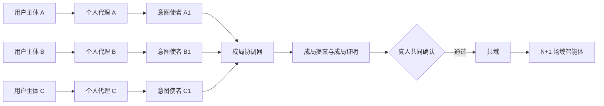
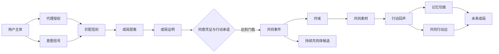
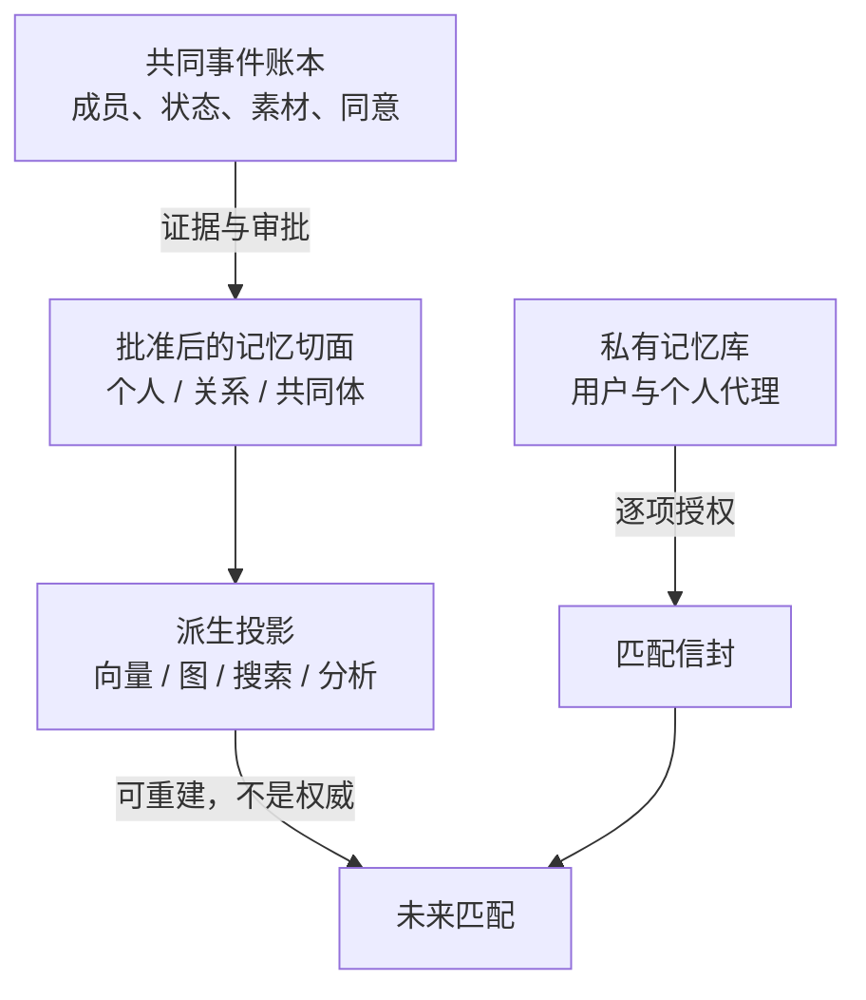
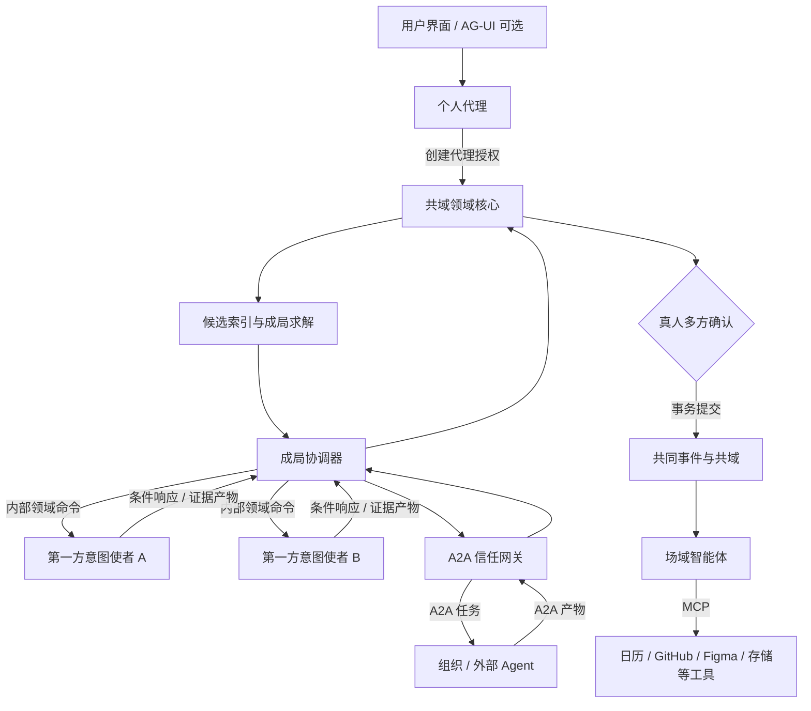
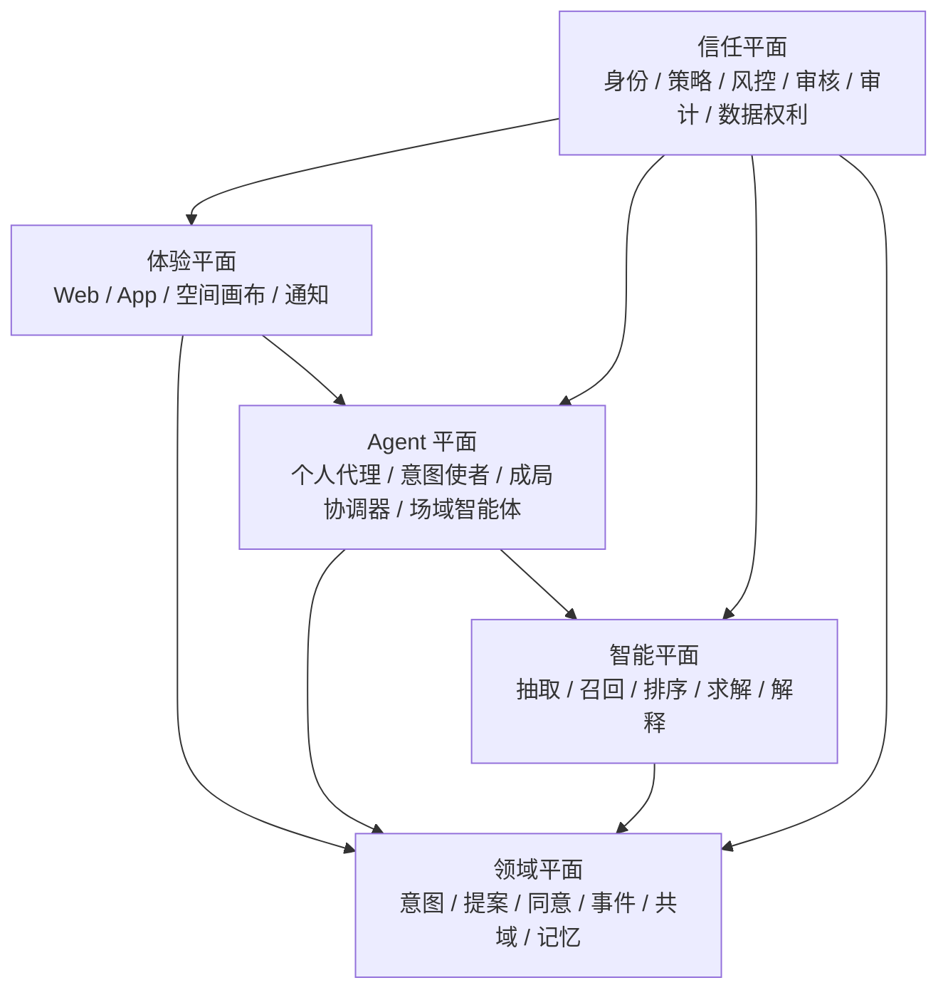
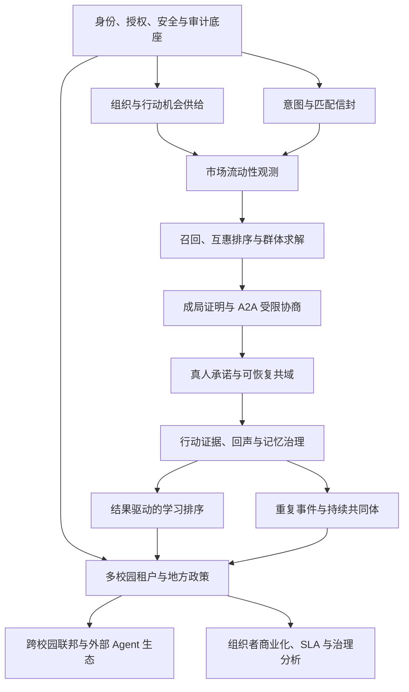

# 共域 CoField：AI 校园社交连接器完整产品说明

- 状态：产品方向与系统边界已确认
- 日期：2026-08-11
- 面向：完整、可扩展、可治理的产品级系统
- 首个高密度场景：校园项目、比赛、科研与共同创作组队
- 产品范式：以共同事件为核心的 A2A（Agent-to-Agent）协作式社交基础设施

---

## 阅读导航

| 阅读目标 | 重点章节 |
|---|---|
| 快速理解产品 | 1 执行摘要、2 赛题理解、3 产品原则、5 标志性机制、6 用户旅程 |
| 理解底层逻辑 | 7 领域模型、8 冷启动与记忆、9 匹配与成局、10 共域 |
| 评估 A2A 与技术架构 | 11 A2A、12 系统架构、13 规模化、14 开源底座 |
| 评估能否真实运营 | 15 信任治理、16 流动性增长、17 组织者与商业、18 指标、19 恢复 |
| 进入规划与评审 | 20 能力依赖、21 验收、22 护城河、23 取舍、24 锁定决定、25 研究门槛 |

配套领域词汇与不变量见 [`CONTEXT.md`](../../../CONTEXT.md)。

---

## 1. 执行摘要

共域不是校园通讯录、校园墙、陌生人卡片推荐，也不是让两个数字分身替真人交朋友。它解决的是一个更具体、也更有价值的问题：

> 当一个学生只有“此刻想做什么”，却没有完整资料、现成关系和主动破冰能力时，系统如何把模糊意图变成可回应的行动条件，找到一个真正能成事的小组；又如何在所有真人确认后，把这次行动变成多人共同拥有的空间和下一次连接的可信依据。

产品从头到尾围绕同一条价值链：

```text
当下意图
→ 可回应的匹配信封
→ 可行动的成局提案
→ 受限的 Agent 协商
→ 真人共同承诺
→ 共同事件与共域
→ 行动证据与共同回声
→ 可撤销的记忆切面
→ 更好的下一次成局
```

三个连续机制构成产品辨识度：

1. **成局证明**：输出的不是“你们有 92% 相似”，而是“这组人为什么有能力、有时间、有互惠价值地把事情做成，以及还差哪些真人决定”。
2. **N+1 共域**：真人确认后，匹配期的个人意图使者退出，一个只属于共同事件、由 N 名成员共同约束的场域智能体诞生。
3. **行动回声**：作品、照片、任务结果和复盘，经相关人员确认后形成有来源、有权限、有时效的记忆切面，空间因此生长，未来匹配也因此变得更可信。

一句话定位：

> 不是推荐一个人，而是形成一个能够一起完成事情的最小共同体；不是保存一次活动，而是让行动留下一个会继续生长的共同地方。

本方案采用 A2A，但明确其边界：**A2A 是代理之间的任务传输与互操作协议，不是身份、同意、群体共识或长期记忆的权威系统。** 用户同意、成员关系、事件生命周期和共享记忆始终由产品领域核心管理。

---

## 2. 对赛题的理解

### 2.1 分享会真正提出的命题

分享会没有要求再做一个“AI 聊天功能”，而是给出了一条关系形成路径：

```text
被看见 → 低压力回应 → 共同行动 → 共同记忆 → 下一次互动
```

其中有四个判断尤其关键：

- 校园不缺人，缺的是把“附近的陌生同学”变成“愿意一起做事的同伴”的转换机制。
- AI 应把“我喜欢摄影”翻译成“本周末要拍毕业短片，缺一个会调色的人”这类可回应意图。
- Agent 可以预热、比较和整理，但是否回应、披露、见面、承诺和保留记忆必须回到真人。
- AI 退出后若只剩匹配记录或聊天记录，关系没有真正发生；有价值的是共同角色、作品、记忆和下一次行动理由。

因此，赛题表面上是“AI 校园社交连接器”，底层其实在问：

> 能否把一次短期意图安全地编译成一次多方共同动作，并让共同动作成为关系的可感知资产？

### 2.2 当前校园工具的结构性断点

现有渠道解决了“发布”，但没有完整解决“成局”：

| 工具 | 擅长 | 断点 |
|---|---|---|
| 校园墙、朋友圈、小红书、抖音帖子 | 扩散需求 | 表达模糊、触达偶然、缺少互惠判断 |
| 微信群、课程群、比赛群 | 聚集已知人群 | 噪音高、一次性、沉淀为群聊而非关系资产 |
| 通讯录、社交卡片 | 展示身份 | 冷启动资料空洞，静态标签不能证明能否一起行动 |
| AI 陪聊、数字分身 | 降低表达成本 | 容易让 AI 互动替代真人接管，造成虚假繁荣 |
| 活动平台、票务工具 | 发布与报名 | 不解决角色互补、边界协商和行动后的关系延续 |

共域要补的是这段缺口：

```text
“我也想” 与 “我们真的一起做” 之间
```

### 2.3 选择“项目组队”作为首个产品楔子

项目、比赛、科研和共同创作具备五个适合建立产品闭环的属性：

1. 有明确目标和截止时间；
2. 需要角色与能力互补，而非单纯兴趣相似；
3. 存在可表达的时间、地点、署名、公开范围等硬边界；
4. 有作品、提交物、任务结果等可验证行动证据；
5. 能自然引发第二次合作、能力交换或持续共同体。

户外活动、城市探索、学习搭子和志愿活动可复用同一领域模型，但应采用不同风险模板和安全策略。

---

## 3. 产品北极星、原则与边界

### 3.1 北极星价值

共域优化的不是浏览、聊天或 Agent 活跃，而是“真实完成的共同事件”及其关系延续。产品以每个活跃校园每周**已完成且存在合规完成证据的共同事件数**衡量有效规模，并以**首次参与者在限定窗口内发起或加入第二次自愿共同动作的比例**约束质量。

合规完成证据可以是成员确认的任务完成、作品提交或组织者验收，不要求用户批准行动回声或长期记忆。前者防止只经营少量成功案例，后者确保第一次行动留下了继续生长的理由；两者必须与安全、公平和撤销指标共同观察。

### 3.2 七条产品原则

1. **意图优先于画像**：先问此刻要完成什么，再按需调用历史；不要求用户注册时解释完整的自己。
2. **组队优先于相似**：目标是角色完整、约束可行、互惠平衡的小组，而非最相似的两个人。
3. **真人拥有关系权**：Agent 不自动披露、邀约、接受、承诺、建群或发布共同记忆。
4. **事件优先于聊天**：聊天只是协调媒介，共同事件才是关系和长期记忆的来源。
5. **证据优先于推断**：能力与可靠性来自经确认的行动证据，不能来自无来源的人格判断。
6. **共同所有优先于平台占有**：共域和共享记忆由参与者共同约束，可见、可撤销、可导出。
7. **可解释优先于神秘分数**：系统展示满足的条件、证据和风险，不制造“灵魂队友”式幻觉。

### 3.3 明确不成为

- 不成为公共信息流、校园通讯录或无限滑卡产品；
- 不预测谁会成为朋友，不给用户贴永久人格或熟悉度标签；
- 不让 Agent 在用户不知情时开展开放式社交；
- 不以聊天量、连续签到、养成时长代表关系质量；
- 不把私聊、完整课表、实时位置或私人联系方式默认纳入匹配；
- 不以付费改变自然匹配顺序或出售隐私画像；
- 不把 A2A、向量库、图数据库或某个 Agent 框架误当成产品本体。

---

## 4. 参与者与核心任务

| 参与者 | 核心任务 | 最害怕的失败 | 产品承诺 |
|---|---|---|---|
| 发起者 | 把一个模糊想法变成能成事的队伍 | 无人回应、遇到不靠谱的人、解释成本过高 | 低负担表达、可解释成局、清楚的下一步 |
| 候选参与者 | 判断是否值得加入并保护边界 | 被骚扰、信息被过度披露、加入后价值不对等 | 最小披露、条件响应、体面拒绝、明确互惠 |
| 组织者 | 为比赛、课程、社团或实验室形成多个小组 | 供需失衡、热门者被挤兑、过程不可追踪 | 结构化需求池、公平分配、成局与完成度洞察 |
| 已成局成员 | 协调行动并共同留下成果 | 群聊沉没、责任不清、AI 喧宾夺主 | 空间化协作、场域智能体、共同行动回声 |
| 校园运营与安全人员 | 维护真实身份、处理风险和申诉 | 冒用身份、线下伤害、算法歧视、证据失控 | 分级风控、审计链、撤销与申诉工具 |
| 外部工具/Agent 提供方 | 在明确权限下提供能力 | 协议耦合、权限越界、数据责任不清 | 标准 A2A/MCP 边界、能力清单、最小授权 |

### 4.1 关键角色关系



个人代理长期存在，但其私有记忆不自动外流；意图使者短期存在，只能在代理授权范围内参与本次成局；场域智能体只在共同事件成立后存在，并属于共域。

---

## 5. 三个标志性机制

### 5.1 成局证明：从“相关”升级到“能行动”

成局证明回答五个问题：

1. **为什么是这几个人？** 角色、能力和资源如何覆盖目标。
2. **为什么是现在？** 时间、地点、截止期限是否相交。
3. **为什么对每个人都有价值？** 每人的贡献与获得是否基本平衡。
4. **证据从哪里来？** 当前自述或已获准的历史行动证据是什么。
5. **还有什么不能替人决定？** 哪些红线、署名、公开范围或线下边界仍待确认。

示例：

```text
目标：周五前完成一支 60 秒校园流浪猫短片

可成局依据
✓ 角色覆盖：策划、拍摄、剪辑
✓ 时间交集：周三 19:00–21:30，周四 14:00–18:00
✓ 地点可行：三人均授权显示“可到东校区”
✓ 经历证据：剪辑候选有两次已确认短片交付记录
✓ 互惠价值：策划获得作品，摄影练习叙事拍摄，剪辑获得署名素材

需要真人决定
△ 是否公开发布以及发布平台
△ 署名顺序与素材二次使用范围
△ 是否允许出现人物正脸

不确定性
△ 摄影候选没有夜景项目证据，当前依据来自本人本次自述
```

系统禁止把不同维度压缩成一个无法检查的总分。内部可以有排序分，但用户界面必须展示构成因素、来源和约束。

### 5.2 N+1 共域：共享 Agent 属于事件，而非某个人

匹配完成前，个人意图使者只交换受限结构化信息；确认完成后，它们结束本次任务。系统随后创建 N 名真人共同拥有的共域，并生成一个场域智能体。

场域智能体具有四类职责：

- **协调**：把已确认目标转为任务、时间线、待办和提醒草稿；
- **维护边界**：标示哪些信息可见、哪些决定需要谁重新确认；
- **整理证据**：接收作品、图片、链接和任务结果，保留来源；
- **提出延续**：在成员主动触发时，基于未完成事项或共同兴趣提出下一次行动种子。

它不能：

- 读取任一成员未共享的私有记忆；
- 替成员修改角色、署名、时间或公开边界；
- 主动把共域内容带到另一个共域；
- 以任何成员口吻对外发送消息；
- 将未批准的推断发布为共同记忆。

### 5.3 行动回声：空间状态证明关系发生过

共域不是事件结束即沉没的群聊。它以空间对象呈现共同动作，并在不同阶段改变形态：

| 阶段 | 空间中的核心对象 | 场域智能体的存在方式 |
|---|---|---|
| 种子 | 共同目标、成员席位、角色、红线 | 解释成局依据，提示未确认项 |
| 筹备 | 时间线、任务、素材位、风险与依赖 | 协调草稿、冲突提示、提醒 |
| 行动 | 现场素材、任务进度、变更记录 | 按需帮助，不抢占主界面 |
| 回声审阅 | 作品、关键瞬间、贡献、复盘草稿 | 聚合证据并请求相关人确认 |
| 记忆发布 | 经确认的共同故事与记忆切面 | 解释来源、用途、有效期 |
| 延续 | 下一次行动种子、重复协作线索 | 仅在成员主动唤起时参与 |

空间只因行动证据生长，不因聊天量、签到、装扮消费或 Agent 对话轮数生长。

---

## 6. 完整用户旅程

### 6.1 意图产生：不要求先做一份完整自我介绍

用户输入：

> 我想做一个关于校园流浪猫的一分钟短片，周五前完成。我会写脚本，但不认识会拍摄和剪辑的人。

AI 把自然语言编译为用户可检查的意图：

```yaml
goal: 周五前完成 60 秒校园流浪猫短片
offers:
  - 脚本与策划
needs:
  - 拍摄
  - 剪辑
time_window: 周三至周五
location_scope: 校内，具体校区待确认
team_size: 3-4
boundaries:
  - 人物正脸需另行确认
open_questions:
  - 是否公开发布
  - 署名规则
```

AI 只追问一到两个会改变可行空间的问题，例如“你能到哪个校区？”或“必须本周五前发布，还是完成初稿即可？”。它不追问与本次成局无关的性格、MBTI 或完整履历。

### 6.2 授权：生成匹配信封

用户逐项确认本次可以使用与披露的信息：

- 当前目标、供给、需求和时间；
- 粗粒度地点；
- 需要被满足的安全或协作边界；
- 可选的作品链接；
- 允许引用的历史记忆切面。

每项信息都带有用途、接收范围和有效期。用户可以选择“只用于平台求解，不向候选展示”或“可在成局证明中展示摘要”。

### 6.3 召回与求解：先找可行集合，再组织小组

平台先用硬约束和权限策略缩小候选集，再做语义与图谱召回，最后由约束求解器生成小组，而不是让所有 Agent 两两对话。

用户收到少量高质量提案，每个提案都带成局证明、待决定事项和失效时间。

### 6.4 受限协商：Agent 先把可比较的问题讲清楚

候选个人代理可以返回：

- 时间是否可行；
- 某项能力证据是否允许被引用；
- 接受需要满足的条件；
- 哪个字段拒绝披露；
- 哪些冲突必须交给真人。

代理不能闲聊、代替用户“聊出感情”或给出最终接受。协商结果是一份结构化差异清单，而不是一段供评委观赏的 Agent 对话。

### 6.5 真人会晤：确认边界与行动

当提案已达到“可讨论”状态，真人进入一个低压力确认界面：

- 查看共同目标和每人的角色；
- 只讨论未解决事项；
- 选择接受、条件接受、修改或体面拒绝；
- 明确第一个小行动，例如“周三 19:00 线上看脚本”。

提案任一实质字段变更后，受影响成员需重新确认。达到规则定义的确认门槛后，系统才原子化创建共同事件和共域。

### 6.6 行动与回流：让事实而非话术成为记忆

共域承接计划、任务和素材。行动结束后：

1. 成员或外部工具回传作品、照片、文档、提交链接或任务状态；
2. 场域智能体根据证据生成行动回声草稿；
3. 涉及个人贡献、能力或关系的表述由相关人员逐项确认；
4. 获准内容形成记忆切面和共同行动边；
5. 用户未来发起相关意图时，系统按权限检索这些切面；
6. 高重叠成员多次行动后，系统提出“是否形成持续共同体”，但不自动建群。

---

## 7. 核心领域模型



### 7.1 聚合根与权威边界

| 聚合 | 权威事实 | 关键不变量 |
|---|---|---|
| 意图 | 当前目标、约束、TTL、授权范围 | 可撤回；不能被历史画像覆盖 |
| 成局提案 | 候选成员、角色、版本、条件响应、证明 | 确认前不产生关系；过期后不可提交 |
| 同意 | 谁对哪个版本、什么目的作何决定 | 修改实质字段必须重新确认 |
| 共同事件 | 成员、角色、目标、状态、风险级别 | 达到门槛后才能创建；状态转换可审计 |
| 共域 | 空间成员、对象、场域智能体授权 | 只承载共同授权内容 |
| 素材 | 来源、上传者、许可、可见范围 | 删除或撤销必须传播到派生内容 |
| 记忆切面 | 结构化断言、证据、同意、时效、用途 | 未批准推断只能是草稿 |
| 持续共同体 | 成员规则、共同目的、治理方式 | 必须由成员主动创建，不能由系统推断成立 |

### 7.2 关键生命周期

**意图信号**

```text
draft → consented → active → matched | withdrawn | expired
```

**成局提案**

```text
assembling → negotiating → awaiting_humans
→ committed → converted_to_event
→ declined | expired | invalidated
```

**共同事件 / 共域**

```text
seed → planning → active → echo_review
→ memory_publish → dormant → collective_candidate
                    ↘ cancelled / archived
```

取消事件可以保留必要审计，但不产生“成功协作”记忆；未完成事件可以沉淀经成员确认的中性事实，例如“项目因时间冲突终止”，但不能自动转化为对人的负面可靠性判断。

### 7.3 人和关系是事件图谱的投影

共域不把用户定义为一份不断变长的个人 Markdown 文档。更准确的结构是：

```text
用户主体
  ├─ 私有记忆库：本人可见、未必可用于匹配
  ├─ 当前意图：短期、目的明确、可过期
  ├─ 共同事件指针：参与过哪些事件
  └─ 记忆切面投影：哪些经确认事实在何种范围内可被使用
```

“熟人”不是一个人工分段标签，而是多个共同事件、重复自愿协作、共同证据和时间衰减的可解释投影。该投影可以用于召回和解释，但不能替代用户对关系的自我定义。

---

## 8. 冷启动与记忆策略

### 8.1 冷启动的根本解法：意图足够，画像不是前置条件

新用户无需填写完整资料。首次成局只需要：

- 想完成什么；
- 能贡献什么、缺什么；
- 时间、粗粒度地点、期限和团队规模；
- 一至三个真正影响行动的偏好；
- 明确边界和排除条件；
- 可选的作品或表达线索。

冷启动不是“伪造长期记忆”，而是让当前意图具备足够的可回应结构。历史为空时，系统仍可依据角色覆盖、时间交集、地点、互惠价值和本次证据形成可行小组。

### 8.2 不采用固定权重，采用分层约束与校准

产品不把“意图 75%、历史 20%”写死为长期规则，而采用以下优先级：

1. **安全、同意和硬约束**：不可被任何软分抵消；
2. **当前意图可行性**：目标、角色、时间、地点、团队规模；
3. **互惠与组合质量**：每个人能贡献和获得什么；
4. **相关且获准的证据**：只在与当前任务相关时加权；
5. **市场公平项**：曝光、拥挤、冷启动保护、拒绝后的重复触达抑制；
6. **探索项**：保留少量受控探索，避免系统只重复旧关系。

系统根据不同场景、学校和风险等级做离线校准与在线实验，但成局证明必须始终可追溯到实际因素。

### 8.3 四层记忆架构



- **私有记忆库**：用户自己的表达、偏好和草稿；默认不共享。
- **共同事件账本**：多个成员共同拥有的事实与素材，带完整来源和权限。
- **批准后的记忆切面**：从证据派生、经过相关人确认的结构化事实。
- **派生投影**：为召回、图遍历、搜索和分析服务，可删除、可重建、不能承载同意。

### 8.4 记忆切面最小结构

以下是“仅描述单个用户”的切面示例；关系或共同体切面必须声明全部被描述主体及审批策略：

```yaml
facet_id: mf_...
subject_type: person
subject_ids: [u_123]
claim_type: demonstrated_skill
claim:
  skill: video_editing
  context: 60s_documentary
source_event_ids: [evt_456]
evidence_artifact_ids: [art_789]
asserted_by: field_agent_draft
confidence: 0.86
visibility: private | event_members | campus_summary | public
matching_allowed: true
purpose_scope: [creative_team_formation]
approval_state: approved
approval_policy_id: self_affirmative_v1
required_approvers: [u_123]
subject_approvals:
  u_123:
    state: approved
    consent_receipt_id: cr_...
consent_receipt_ids: [cr_...]
objection_state: none
review_state: current
valid_time:
  from: 2026-08-01
  to: 2027-08-01
record_time:
  created_at: 2026-08-03T10:30:00Z
  superseded_at: null
revocation_state: active
```

关系或共同体切面的 `required_approvers` 必须包含全部被描述成员，或引用成员事先明确接受的治理规则；系统必须保存逐主体状态，不能用一个 `approved_by` 数组掩盖缺失审批。任一异议会把切面置为 `contested` 或 `review_required`，停止其进入新匹配，直至解决或改写。

同时记录“事实在何时成立”和“系统在何时知道/修改该事实”，即双时间模型。这样可以处理过期技能、角色变化、迟到审批和撤销传播。

### 8.5 多人共同记忆的同意规则

- 只描述某人个人贡献：至少该本人确认；
- 描述两人或多人关系：被描述的所有成员确认，或采用事先明确的共域治理规则；
- 公开作品：按素材许可和署名规则单独确认；
- AI 总结：默认草稿，不因无人反对自动生效；
- 一人撤销源素材：依赖该素材的切面失效或进入复核；
- 一人退出共域：不自动删除其他人的合法记录，但停止其内容的新用途，并按共同协议处理共享副本。

---

## 9. 匹配与成局系统

### 9.1 可扩展流水线：避免全校 Agent 两两对话

全校每个用户都和所有用户进行 A2A 协商会形成 O(N²) 成本、隐私暴露和骚扰风险。正确的生产路径是漏斗式：


只有经过权限、硬约束、召回、排序和求解的少量候选才进入 A2A 协商。Agent 负责减少真人需要讨论的未知项，而不是承担搜索全空间的职责。

### 9.2 意图编译

LLM 适合将自然语言转成严格 schema，并标记不确定字段；确定性校验负责：

- 字段类型、枚举和时间解析；
- 敏感信息检测与最小化提醒；
- 硬约束是否自相矛盾；
- 哪些信息需要用户显式授权；
- 哪些问题会实质改变可行集合。

未经用户确认的 LLM 抽取不能直接进入匹配。原始表达和结构化结果并存，以便追溯和修正。

### 9.3 多路候选召回

候选召回由多个可独立评估的通道组成：

1. **供需倒排**：角色、技能、资源和需求的结构化索引；
2. **语义召回**：当前意图、作品摘要和获准记忆切面的向量相似；
3. **事件图召回**：相关共同事件、重复协作和跨圈层桥接信号；
4. **组织供给**：比赛、课程、实验室和社团发布的验证需求；
5. **探索召回**：给新用户、新供给和低曝光候选保留受控机会。

召回不是最终推荐。它只生成一个足够广而安全的候选池，随后由互惠排序和群体求解处理。

### 9.4 互惠排序

普通推荐只预测“发起者是否喜欢候选”；共域需要同时估计：

- 候选是否可能对该意图有真实收益；
- 双方/多方接受概率；
- 加入后能否完成共同动作；
- 候选当前承诺负载与曝光拥挤；
- 对新用户和非热门用户是否公平；
- 是否反复把已拒绝的需求推给同一个人。

排序目标是多目标、带约束的市场分配，而不是单边 CTR。学习模型只在积累足够的真实接受、拒绝、完成、取消和行动回声后使用；冷启动阶段以规则、校准和求解为主。

取消、缺席、拒绝、屏蔽和安全退出默认只用于流程恢复与市场容量统计，不能直接成为隐藏的个人可靠性分。拒绝只产生接收方特定的“不再重复触达/冷却”状态和聚合市场反馈，不成为候选质量信号。只有经过情境编码、事实核验、本人可见、可申诉且政策允许的履约结果，才可在同一目的下形成有限、时效化信号；举报与安全退出永远不能降低匹配机会。优先使用正向、可验证的能力证据，而不是累积负面社会信用。

### 9.5 群体约束求解

使用约束求解器表示：

**硬约束**

- 时间交集与截止期限；
- 校区或可到达范围；
- 团队人数上下限；
- 必要角色和角色互斥；
- 屏蔽、拒绝、风控和安全边界；
- 每人并发承诺上限；
- 特定活动的年龄、资质或组织规则。

**软目标**

- 目标语义一致；
- 技能、资源和角色互补；
- 每人的贡献与获得相对平衡；
- 相关行动证据；
- 适度跨专业、跨圈层；
- 历史履约与重复协作，但避免马太效应；
- 曝光公平、拥挤惩罚和新用户保护；
- 形成后第一步行动的低摩擦程度。

求解对象是：

```text
best_group | intent, hard_constraints, consent_scope,
             reciprocal_value, market_state, safety_policy
```

而不是 `similarity(person_A, person_B)`。

### 9.6 成局证明生成

LLM 只能把确定性求解结果转写成自然语言，不能自行发明原因。每条理由必须引用以下至少一种来源：

- 本次用户主动表达；
- 获准用于匹配的记忆切面；
- 求解器满足的约束；
- 可解释目标项的贡献；
- 当前仍未解决的冲突或不确定性。

证明对象应保留机器可读结构，以便审计、A/B 测试和申诉，而不是只保存一段生成文本。

### 9.7 协商协议

Agent 间只允许固定消息类型：

| 消息 | 含义 | 是否构成同意 |
|---|---|---|
| `ConstraintIntersection` | 报告时间、地点、角色等交集 | 否 |
| `EvidenceCitation` | 提供获准的经历证据摘要与来源引用 | 否 |
| `ConditionalResponse` | 表达“若满足 X，则可进入真人确认” | 否 |
| `Conflict` | 指出不可行约束及受影响字段 | 否 |
| `ProposalRevision` | 提议修改团队或条件 | 否 |
| `DisclosureDenied` | 拒绝披露某字段 | 否 |
| `ConsentRequest` | 请求对应真人处理特定决定 | 否 |

自由文本只允许作为字段补充，并经过内容与隐私策略。任何消息都不能把 `agent_suggested` 误写为 `human_accepted`。

### 9.8 真人确认与事务提交

确认采用版本化、多方、可撤回模型：

1. 每名成员对同一提案版本作出明确决定；
2. 条件接受会生成新版本，而不是隐藏修改；
3. 平台检查成员、角色、安全政策和确认门槛；
4. 通过后，在同一事务中写入承诺、创建共同事件、成员关系与共域；
5. 事务提交后才生成场域智能体授权；
6. 任一外部通知失败可重试，但不能造成重复事件。

### 9.9 无可行解时的产品行为

系统不伪造候选，而是返回一份“阻塞证明”：

- 哪些硬约束共同导致无解；
- 放宽哪一项会增加多少候选；
- 哪些条件涉及安全，不能建议放宽；
- 是否可以订阅未来供给或邀请一个已知同学；
- 是否将需求发布给验证组织者补充供给。

这把“没有匹配”从挫败转为一个可操作的下一步。

---

## 10. 共域：把协作界面做成关系资产

### 10.1 “空间感”不是 3D，而是关系可见

空间感的本质不是建模一个虚拟校园，而是让用户一眼看见：

- 我们共同要完成什么；
- 谁承担什么角色；
- 现在卡在哪里；
- 哪些东西由我们共同创造；
- 这次行动留下了什么；
- 下一次为什么还值得回来。

因此共域采用结构化空间画布而非聊天记录作为主界面。聊天、评论和通知可以存在，但退居对象旁边。

### 10.2 空间对象

| 对象 | 生命周期 | 权限特点 |
|---|---|---|
| 目标核 | 从成局提案继承，可版本化 | 实质修改需相关成员重新确认 |
| 成员席位 | 角色、贡献、获得、边界 | 只能由本人或治理规则修改 |
| 任务与里程碑 | 筹备至完成 | 可分配、认领、评论和留证 |
| 决策门 | 署名、公开、时间等待确认项 | 明确需要谁确认，不能被 AI 越过 |
| 素材卡 | 图片、文档、链接、提交物 | 带来源、许可和可见范围 |
| 行动轨迹 | 状态变更与关键节点 | 来自领域事件，不等于监控用户 |
| 回声卡 | 共同故事、成果、贡献与复盘 | 默认草稿，多方确认后发布 |
| 下一步种子 | 延续行动建议 | 由成员主动启用，不自动骚扰 |

### 10.3 行动回调

行动证据不应只依赖用户手动复述。共域通过 MCP 工具、Webhook 和文件接入连接已有工作流，例如：

- GitHub：Issue、PR、Commit、Release；
- Figma：文件、评论、版本和导出作品；
- 日历：经成员授权的事件状态，不读取完整私人日历；
- 文档与云盘：特定文件和版本；
- 比赛/课程平台：报名、提交、评审结果；
- 相机与上传：照片、视频、录音和现场笔记；
- 地图/签到：仅对适用场景使用粗粒度、短时和多方同意的数据。

外部回调首先成为“待核实证据”，经过来源验证和成员确认后才影响记忆或关系投影。没有工具接入时，核心流程仍可通过人工上传和确认工作。

### 10.4 场域智能体的能力模型

场域智能体不应是一个无限工具权限的超级 Agent，而是能力令牌驱动的组合：

```text
read_shared_goal
read_approved_space_objects
draft_plan
draft_reminder
request_member_decision
ingest_external_artifact
draft_action_echo
propose_memory_facets
suggest_next_action
```

高风险动作永远需要真人或共域治理规则：

```text
change_commitment
invite_or_remove_member
publish_artifact
share_outside_space
approve_memory
spend_money
book_or_cancel
```

### 10.5 从一次事件到持续共同体

同一批成员多次完成事件后，共域可以出现“持续共同体候选”：

- 系统说明依据：共同完成次数、角色延续、下一步需求；
- 成员选择是否建立长期共同体；
- 共同体拥有自己的目标、成员规则和可见范围；
- 每次新行动仍创建独立共同事件，保留清晰的同意和证据边界；
- 共同体不是无限共享私有记忆的容器。

这样既支持“一次组队”，也支持社团、创作小组、实验室协作和长期兴趣社群。

---

## 11. A2A 产品与协议设计

### 11.1 结论：采用 A2A，但只放在正确的一层

[Agent2Agent Protocol](https://a2a-protocol.org/latest/specification/) 已进入 Linux Foundation 治理并发布 1.0 规范，适合处理代理发现、能力描述、任务生命周期、流式状态和结构化产物交换。共域在**跨越运行时、组织或信任边界**时采用 A2A，例如连接第三方个人代理、校园组织 Agent 和外部服务商 Agent。

平台内部由共域直接运行的个人代理、意图使者和成局协调器使用版本化领域命令与适配器，不强制绕行 A2A 网络协议。这样保留统一的任务语义和未来互操作能力，同时避免把一方系统内的每次函数调用变成远程 Agent 协商。内部适配器和 A2A Adapter 都映射到同一套非权威任务/产物 schema。

但 A2A 不提供以下产品语义：

- 真人身份与校园资格；
- 多方同意、撤销和提案版本；
- 群体共识和原子化成员提交；
- 共域生命周期与共同所有权；
- 记忆来源、审批、删除和用途控制；
- 内容治理、申诉和算法公平。

因此：

> A2A 是代理互操作层；共域领域核心才是关系事实的权威。

### 11.2 A2A 拓扑



### 11.3 A2A 中传递什么

跨信任边界时，适合进入 A2A Task/Message/Artifact 的内容：

- 经共域信任注册表验证的 Agent Card 与能力清单；
- 带短期令牌的匹配信封引用或最小化内容；
- 可行性检查任务；
- 条件响应、冲突、证据摘要和提案修订；
- 长任务的状态、流式进度和推送通知；
- 需要真人介入时的 `auth-required` 类状态；
- 成局证明的结构化草稿产物。

不进入或不能只依赖 A2A 的内容：

- 完整个人档案和私有记忆；
- 同意账本、最终签名和撤销事实；
- 权威成员关系、事件状态和共享记忆；
- 明文校园凭证、敏感位置和私人联系方式；
- 让对方 Agent 直接执行的不可逆承诺。

### 11.4 匹配信封令牌

每次外发任务携带短期、目的绑定的令牌：

```yaml
subject_pseudonym: psn_...
envelope_id: env_...
allowed_fields: [goal, role_need, coarse_availability]
audience: [agent_broker_01]
purpose: formation_feasibility
context_id: proposal_...
expires_at: 2026-08-11T12:00:00Z
nonce: ...
policy_version: 7
revocation_ref: rev_...
```

令牌只能证明调用方在特定目的下可访问特定字段，不能证明用户已接受成局。所有服务必须在每次请求上重新执行授权策略和撤销检查。

### 11.5 多方成局的正确编排

A2A 本身是任务/对等通信协议，不是多方共识协议。共域采用中心化成局编排：

1. 成局协调器创建一个提案任务；
2. 对第一方意图使者发送内部领域命令，对外部/独立 Agent 经信任网关扇出少量 A2A 请求；
3. 收集结构化条件响应；
4. 产品工作流检查冲突、门槛和策略；
5. 向真人发出逐项确认请求；
6. 数据库事务提交共同事件；
7. 创建场域智能体及其最小授权。

这比让多个 Agent 自行“投票建群”更可审计，也能处理超时、撤销、重复消息和部分失败。

### 11.6 A2A、MCP 与 AG-UI 的分工

| 协议/层 | 共域中的职责 | 不负责 |
|---|---|---|
| A2A | Agent 发现、代理间任务、状态与产物 | 工具访问、真人同意、领域事务 |
| MCP | Agent 调用日历、代码、设计、存储等工具与资源 | Agent 间协商、群体共识 |
| AG-UI（可选） | 将 Agent 状态、请求确认和流式产物呈现给用户 | 服务间权威通信 |
| 共域领域 API | 同意、成员、事件、共域、记忆和审计 | 通用 Agent 互操作标准 |

### 11.7 协议安全基线

- 固定兼容的 A2A 1.0 协议边界，SDK 类型不得渗透为领域模型；
- 使用 TLS，服务身份采用 OAuth/OIDC 或 mTLS；
- 对 Agent Card 做可信分发或签名校验，不把其自述能力视为安全事实；
- 每个 Task 有幂等键、TTL、预算、最大轮次和允许消息类型；
- 所有外部 Agent 输出视为不可信输入，重新校验 schema、权限和内容；
- A2A `tenant` 等路由字段不等于授权；
- 保留任务、产物哈希、策略决策和人工确认的关联审计；
- 外部 Agent 被撤销或不可用时，提案可回退为人工确认或重新求解。

Agent Card 的可信度来自共域信任注册表，而非卡片自述。注册表至少保存：发行者、签名链、所属校园/组织、代表的真人主体、验证过的能力、信任级别、有效期和撤销状态。若签名、归属或能力验证失败，网关拒绝敏感任务，或降级为只接收公开机会、不可请求披露的低信任模式。用户界面始终显示“哪个 Agent 正在代表谁，以及为何有权参与本次任务”。

---

## 12. 产品级系统架构

### 12.1 五个平面



- **体验平面**让用户表达意图、审阅提案、作出决定和进入共域。
- **Agent 平面**负责有限代理任务，不直接拥有关系事实。
- **领域平面**是用户同意、事件和记忆的交易权威。
- **智能平面**提供可替换的非确定性理解与确定性求解能力。
- **信任平面**横切所有服务，拒绝“先做增长、以后补安全”。

### 12.2 逻辑服务边界

| 服务 | 责任 | 不应承担 |
|---|---|---|
| Identity & Campus Trust | 账号、校园资格、组织认证、设备与风险信号 | 公开展示全部真实身份 |
| Intent Service | 意图版本、TTL、结构化确认 | 长期人格画像 |
| Consent & Policy | 代理授权、同意凭证、撤销、用途策略 | 推荐排序 |
| Formation Service | 候选召回编排、提案、版本和状态 | 直接代表真人承诺 |
| Matching Intelligence | 召回、互惠排序、求解、证明结构 | 关系事实权威 |
| A2A Gateway | Agent Card、任务、流式状态、速率与安全边界 | 产品同意账本 |
| Event & Space Service | 共同事件、成员、空间对象与生命周期 | 私有个人记忆 |
| Artifact Service | 上传、扫描、许可、版本和来源 | 自动批准记忆 |
| Memory Service | 切面草稿、审批、时效、撤销传播与派生索引 | 原始事件替代品 |
| Trust & Safety | 风险分级、举报、屏蔽、审核、申诉 | 偷偷改变关系定义 |
| Workflow Service | 超时、提醒、审批等待、撤销传播、重试 | 保存最终业务权威 |
| Analytics & Experiment | 指标、实验、偏差和市场健康 | 使用未授权明细数据 |

### 12.3 权威数据与派生数据

系统采用“一份交易权威，多种可重建投影”：

1. **Postgres 交易核心**：身份引用、授权、同意、提案、成员、事件、空间、素材元数据和记忆切面；
2. **追加式领域事件账本**：记录发生了什么，用于审计、重放、派生和撤销传播；
3. **对象存储**：保存文件与媒体，数据库只保存来源、哈希、许可、密钥引用和生命周期；
4. **向量、图、搜索和分析投影**：服务于召回、遍历和指标，可随时从权威事实重建；
5. **短期缓存与实时状态**：Presence、光标、流式进度等不作为业务事实。

禁止以下反向依赖：

- 不能以向量库里“搜得到”证明用户已同意；
- 不能以图数据库里有边证明共同事件已确认；
- 不能以 Agent memory 里记住某事证明事实仍有效；
- 不能以实时广播成功证明空间对象已持久化；
- 不能让分析仓库反写权威关系状态。

### 12.4 核心数据模型

| 数据域 | 关键表/实体 | 关键字段或约束 |
|---|---|---|
| 身份 | `users`, `identity_verifications`, `devices` | 前台身份与后台资格分离 |
| 组织 | `organizations`, `organization_memberships` | 社团、院系、实验室、赛事方与角色 |
| 机会供给 | `action_opportunities`, `opportunity_seats`, `waitlists` | 目标、席位、资格、期限、负责人 |
| 意图 | `intent_signals`, `intent_versions` | TTL、场景、结构化约束、撤回状态 |
| 授权 | `delegation_grants`, `match_envelopes`, `consent_receipts` | 目的、字段、对象、版本、期限、撤销 |
| 成局 | `formation_proposals`, `formation_members`, `formation_proofs` | 版本、角色、条件响应、状态、幂等键 |
| 事件 | `coaction_events`, `event_memberships`, `event_stewards` | 风险级别、角色、承诺、负责人、状态 |
| 共域 | `shared_spaces`, `space_objects`, `space_object_versions` | 对象类型、所有权、协作状态、可见范围 |
| 素材 | `artifacts`, `artifact_versions`, `artifact_approvals` | 哈希、来源、许可、扫描、删除状态 |
| 回声 | `action_echoes`, `echo_claims`, `echo_approvals` | 草稿、证据引用、逐项同意 |
| 记忆 | `memory_facets`, `facet_approvals`, `facet_revocations`, `object_subjects`, `provenance_edges` | 双时间、用途、范围、涉及主体、来源、有效期 |
| 图投影 | `coaction_hyperedges`, `coaction_edge_projection` | 从确认事件派生，可重建 |
| Agent | `agent_registrations`, `agent_tasks`, `agent_artifacts`, `pending_agent_actions` | Agent Card、任务状态、预算、待批准副作用、审计引用 |
| 安全 | `blocks`, `reports`, `moderation_cases`, `appeals` | 屏蔽传播、证据最小化、处置与申诉 |
| 策略 | `policy_decisions`, `policy_epochs`, `revocation_jobs`, `model_runs` | 授权判定、即时失效、撤销传播、模型与数据版本 |
| 事件账本 | `domain_events`, `outbox_messages` | 聚合版本、事件类型、载荷引用、投递状态 |

`relationship_edge` 不作为人工维护的“好友度”；它是从多次共同事件重建的投影。涉及多人共同经历时，应保留超边实体，再按具体查询派生二元边。

### 12.5 一致性与长流程

**强一致事务**用于：

- 提案版本与同意凭证；
- 提案转共同事件；
- 成员加入/退出和关键角色变更；
- 素材许可、记忆批准与撤销；
- 屏蔽、封禁和高风险政策决定。

**最终一致投影**用于：

- 向量索引；
- 图关系投影；
- 搜索索引；
- 分析指标；
- 通知与推荐缓存。

数据库事务通过 Transactional Outbox 写入领域事件。工作流引擎负责可能等待数小时或数周的过程：提案过期、多人审批、提醒、候补补位、改期、回声审阅、删除传播和外部回调重试。工作流只编排，最终状态仍写入领域核心。

所有外部命令必须幂等：

```text
idempotency_key = actor + command_type + aggregate_id + client_request_id
```

重复的 A2A 消息、Webhook 或推送不会创建重复承诺、事件、素材或记忆。

### 12.6 实时协作的双层模型

- Presence、光标、正在编辑、Agent 流式进度：短期实时通道；
- 任务、目标、权限、素材、决定和空间对象版本：持久化领域状态；
- 多人共同编辑文档或画布布局：仅对这些对象使用 CRDT；
- 成员、同意、承诺和事件生命周期：绝不放入 CRDT 解决冲突。

这种分层既保留“空间正在发生”的感觉，也避免离线合并把权限或承诺变成不可预测状态。

### 12.7 可观测性

每个端到端请求关联统一 Trace ID：

```text
用户意图 → LLM 抽取 → 授权 → 候选召回 → 求解
→ A2A 任务 → 真人确认 → 事件事务 → 共域 → 回声 → 记忆投影
```

必须观测：

- 每阶段延迟、失败与降级；
- LLM schema 修正率和用户改写率；
- 求解可行率、阻塞约束和候选池深度；
- A2A 超时、循环、拒绝披露和人类接管；
- 同意版本错误、撤销传播时延；
- 投影延迟和重建一致性；
- AI 成本、每次成局成本和人工介入率；
- 按校园、场景和新人群体分层的公平与安全指标。

日志不得记录原始匹配信封、私聊或未脱敏敏感信息。调试需要采用受控采样、字段级脱敏和访问审计。

---

## 13. 规模化设计

### 13.1 市场单元不是“全校所有人”

匹配流动性的基本单元定义为：

```text
校园 × 行动类别 × 时间窗口 × 所需角色/席位
```

例如“本校 × 本月创作比赛 × 剪辑席位”是一个可运营市场，“所有大学生找朋友”不是。只有当某个市场单元具备足够机会、候选和负责人时才开放自动成局；不足时聚合需求、固定撮合窗口或引导组织者补充供给。

### 13.2 多校园与租户隔离

- 每所学校是政策与数据边界，而不必是独立物理数据库；
- 所有权威表包含 `campus_id`/租户键并实施行级权限与服务端策略；
- 校园资格凭证和公开身份分离，默认只显示完成行动所需信息；
- 跨校园协作必须是单独目的、明确范围和二次同意；
- 学校、地区和活动类型可加载不同审核、保留与线下安全规则；
- 组织者只能访问其机会与成员授权的运营数据，不能读取私人匹配信封。

规模增长后，按校园或区域对高写入表分区；全局只保留必要的匿名化市场健康指标。身份、授权和撤销查询使用一致性优先的路径，召回投影可以区域化和异步更新。

### 13.3 匹配计算扩展

推荐流水线按成本从低到高执行：

1. 权限、屏蔽和租户过滤；
2. SQL/倒排硬约束；
3. ANN 语义召回与图谱召回；
4. 轻量互惠排序；
5. 对有限候选运行 CP-SAT 小组求解；
6. 只对少量提案发起 A2A 协商；
7. 在真人反馈后增量重求解，而非全量重算。

对热门机会设置曝光配额、候选冷却、并发承诺上限和等待队列，防止少数用户被反复邀请。对新用户采用不依赖历史的可行性路径和受控探索份额。

初始生产预算采用可配置上限，而不是无限扩张：

| 阶段 | 默认预算 | 超限行为 |
|---|---:|---|
| 每个召回通道 | 最多 500 个候选 | 分市场/租户分片，记录被截断原因 |
| 多路合并后轻排 | 最多 1,500 个去重候选 | 采用结构化优先级和公平配额裁剪 |
| 精排与求解输入 | 最多 200 人；普通小组 2–12 人 | 拆分机会、固定席位或转异步批求解 |
| CP-SAT 同步预算 | 2 秒求可行解，8 秒改进目标 | 先返回当前可行解；无解则阻塞证明/订阅 |
| 外部 A2A 扇出 | 每个成局任务最多 20 个 Agent，并发最多 8 个 | 分批、候补或人工确认 |
| 单个 A2A 初始响应 | 3 秒软超时；完整协商 15 秒同步窗口 | 状态转异步等待，不把超时当拒绝 |
| 生成给用户的提案 | 默认 2–3 个 | 等用户反馈后增量重求解 |

这些是容量护栏，不是产品真理；应按场景、学校规模、实际压测和完成率调整。达到预算时宁可异步、聚合或明确返回阻塞，也不能通过扩大隐私披露和 Agent 扇出换取表面命中。

授权与 ANN 结合采用“先缩小可见集合，再做语义排序”的实现模式：

1. 按校园、市场单元、用途和策略版本预计算短期 ACL 快照或候选集合；
2. 向量索引按租户/市场分区，查询携带可见集合或服务器端过滤条件；
3. 召回结果再做一次权威授权复核，并记录查询目的和披露预算；
4. 权限变化递增 `policy_epoch`，令旧快照失效并触发重建；
5. 安全测试验证重复查询、结果数量和时延差异不能推断隐藏字段。

若 pgvector 在高选择性 ACL + ANN 场景下无法满足召回/时延目标，再把获准的派生向量迁移到独立向量服务；权威 ACL 与最终授权复核仍留在领域核心。

### 13.4 容量与可靠性目标

产品级目标应按用户感知定义，而非绑定某一云厂商：

| 能力 | 建议目标 |
|---|---|
| 意图保存与授权变更 | p95 < 500 ms，不丢失已确认输入 |
| 首个候选提案 | 普通市场 p95 < 10 s；长求解异步返回 |
| 真人确认事务 | p99 < 1 s，严格幂等 |
| 空间对象持久化 | p95 < 500 ms；实时广播失败不影响保存 |
| 撤销阻止新用途 | 权威服务即时生效 |
| 撤销传播到所有投影 | 目标 < 5 min，并有可观测补偿任务 |
| 核心事件/同意可用性 | 月度 99.95% 目标 |
| 数据恢复 | 关键交易 RPO 接近 0，按演练定义 RTO |

系统应进行故障域隔离：LLM、向量、A2A 外部 Agent 或实时服务不可用时，用户仍能保存意图、查看已有空间、人工确认和上传证据。

### 13.5 数据生命周期与成本

- 未提交意图、匹配信封和失败提案按短 TTL 自动清理；
- 审计事实与原始敏感载荷分离，前者可长期保留哈希和政策引用；
- 媒体采用生命周期策略、去重、缩略图和冷存储；
- 向量只为允许检索的摘要生成，撤销后删除或重建；
- Agent 任务设置轮次、Token、时间和工具预算；
- 学习数据优先使用聚合/去标识特征，训练集有版本、用途和删除重训策略。

---

## 14. 开源复用战略与推荐技术底座

### 14.1 开源是工程红线，不是建议

共域只自研四个差异化岛屿：

1. 意图、机会、授权与成局的领域协议；
2. 互惠小组求解和成局证明；
3. 共域的行动状态、N+1 权限和行动回声；
4. 从真实行动结果反馈下一次匹配的学习闭环。

认证、数据库、对象存储、实时通信、协作编辑、工作流、策略引擎、可观测性、病毒扫描和基础 Agent 协议等通用能力原则上不得从零自研。

任何新增基础设施必须提交：

- 上游项目与可替代候选；
- 许可证及商业兼容性；
- 维护活跃度、发布节奏和安全记录；
- 数据导出、自托管与退出路径；
- 与领域核心的隔离方式；
- 升级、回滚、SBOM 和供应链责任人。

默认“适配上游”而非 fork。必须 fork 时，保留上游来源、同步策略、差异补丁和许可证清单。模型提供方和 Agent SDK 必须可替换，不能让领域 schema 依赖某家模型的输出类型。

### 14.2 推荐开源栈

以下为 2026-08-11 调研快照；实际落地时锁定精确版本并持续运行依赖与漏洞扫描。

| 能力 | 推荐基底 | 许可证/定位 | 共域用法 |
|---|---|---|---|
| Web 与服务端渲染 | [Next.js](https://github.com/vercel/next.js) | MIT | 用户端、组织者工作台、共域入口 |
| 组件与无障碍基建 | [Radix UI](https://github.com/radix-ui/primitives) / [shadcn/ui](https://github.com/shadcn-ui/ui) | MIT | 不自研基础交互与无障碍原语 |
| 权威数据库 | [PostgreSQL](https://www.postgresql.org/) | PostgreSQL License | 同意、事件、空间、记忆的唯一交易权威 |
| 向量扩展 | [pgvector](https://github.com/pgvector/pgvector) | PostgreSQL License | 与权限过滤相邻的语义召回；不是记忆权威 |
| 身份与组织 SSO | [Keycloak](https://github.com/keycloak/keycloak) | Apache-2.0 | OIDC/SAML、组织与校园身份接入 |
| 轻量认证替代 | [Supabase Auth](https://github.com/supabase/auth) | MIT | 邮箱/社交/OIDC 认证；复杂组织 SSO 能力需单独验证 |
| 数据 API | [PostgREST](https://github.com/PostgREST/postgrest) | MIT | 在严格 RLS 前提下加速受控数据 API |
| 实时频道 | [Supabase Realtime](https://github.com/supabase/realtime) | Apache-2.0 | Presence、Broadcast、Postgres 变化；不承载 CRDT 权威状态 |
| 对象存储 | [Supabase Storage](https://github.com/supabase/storage) 或 [SeaweedFS](https://github.com/seaweedfs/seaweedfs) | Apache-2.0 | S3 兼容素材、版本、缩略图；元数据仍在 Postgres |
| 空间画布 | [React Flow](https://github.com/xyflow/xyflow) | MIT | 结构化目标、角色、任务、回声节点 |
| 协同编辑 | [Yjs](https://github.com/yjs/yjs) + [Hocuspocus](https://github.com/ueberdosis/hocuspocus) | MIT | 仅用于文档/画布等协同对象 |
| A2A | [A2A Protocol 与官方 SDK](https://github.com/a2aproject/A2A) | Apache-2.0 | 代理发现、任务、状态与产物交换 |
| 工具协议 | [Model Context Protocol](https://github.com/modelcontextprotocol) | 开放协议生态 | 场域智能体连接日历、代码、设计与内容工具 |
| Schema | [Pydantic v2](https://github.com/pydantic/pydantic) | MIT | 意图、信封、证明和 Agent 消息校验 |
| LLM 类型化调用 | [PydanticAI](https://github.com/pydantic/pydantic-ai)（可选） | MIT | 仅做抽取、草拟和结构化生成 |
| 语义召回/重排 | [sentence-transformers](https://github.com/huggingface/sentence-transformers) | Apache-2.0 | 本地/自托管 embedding 与 reranking |
| 群体求解 | [Google OR-Tools](https://github.com/google/or-tools) | Apache-2.0 | CP-SAT 表达硬约束与可解释软目标 |
| 持久工作流 | [Temporal](https://github.com/temporalio/temporal) | MIT | 多人等待、超时、重试、补位与撤销传播 |
| 授权策略 | [Open Policy Agent](https://github.com/open-policy-agent/opa) | Apache-2.0 | 跨服务用途、角色和能力策略 |
| 事件传输 | [NATS JetStream](https://github.com/nats-io/nats-server) | Apache-2.0 | 领域事件、通知与异步投影 |
| 可观测性采集与指标 | [OpenTelemetry](https://github.com/open-telemetry) + [Prometheus](https://github.com/prometheus/prometheus) | Apache-2.0 | Trace、指标、告警与 SLO；展示/日志后端可替换 |

技术语言可以分工而不分裂领域：Web/BFF 可用 TypeScript；抽取、召回与求解服务可用 Python；所有跨服务交互通过版本化领域 schema、事件或 A2A Artifact，不共享 ORM 实体。

### 14.3 可选组件与采用门槛

| 组件 | 何时采用 | 不能成为 |
|---|---|---|
| [Mem0](https://github.com/mem0ai/mem0) | 需要成熟的记忆抽取/检索便利层，且能把审阅结果写回自有表 | 同意或长期记忆权威 |
| [Graphiti](https://github.com/getzep/graphiti) | 时间图谱查询成为真实瓶颈，团队接受额外图存储运维；最低 `graphiti-core >= 0.28.2` | 关系事实权威 |
| Neo4j/FalkorDB | 派生图查询无法由 Postgres 投影满足 | 唯一数据源；采用前需单独评估许可证 |
| Qdrant | 向量规模、过滤或性能超过 pgvector 能力边界 | 第二套同意/删除系统 |
| AG-UI | 需要标准化 Agent 到前端的人在环状态流 | 领域 API 或 A2A 替代品 |
| PixiJS | 行动回声需要高性能 2D 动画表达 | 权威空间编辑引擎 |
| Grafana / Loki / Tempo | 接受 AGPL-3.0 的独立运维服务，或采用托管商业版本 | 领域核心的链接库或默认无审查依赖 |
| ClamAV | 以隔离扫描服务部署且完成 GPLv2 法律/分发评估 | 应用进程内默认链接库或唯一安全控制 |

Supabase 是多个开源组件与托管服务的组合，不应写成一个许可证或不可拆的平台依赖。采用时分别锁定 Auth、Storage、Realtime、PostgREST 等组件，记录其许可证、自托管成熟度、数据驻留、导出路径以及托管版付费能力；领域核心必须可迁回标准 PostgreSQL 与 S3 API。

MinIO 技术能力成熟，但当前 AGPL-3.0 许可会影响部分闭源 SaaS 部署，应先完成法律审查；严格宽松开源策略下默认选择 Supabase Storage 或 SeaweedFS。Grafana、Loki、Tempo 和 ClamAV 可作为隔离服务采用，但需要确认网络使用、修改、分发、镜像交付和源码义务；它们不列入“无需法律审查”的默认核心。

Graphiti 适合有来源和有效时间的知识图，但应作为可重建投影；采用版本不得低于修复 [CVE-2026-32247 / GHSA-gg5m-55jj-8m5g](https://github.com/getzep/graphiti/security/advisories/GHSA-gg5m-55jj-8m5g) 的 `0.28.2`，并持续执行供应链扫描。Mem0 适合“记忆 API”便利层，但审批、来源、用途和撤销必须留在共域数据库。

### 14.4 明确不选择的基础

- **开放式 AutoGen/Agent 群聊作为成局核心**：难以保证轮次、权限、同意和可解释性；
- **Letta 作为记忆底座**：它是完整状态化 Agent 运行时，边界大于本产品需要；
- **tldraw 作为硬 OSS 基础**：生产授权不是纯粹的宽松开源路径；
- **直接 fork 票务/活动平台**：Hi.Events、pretix 等领域重点是票务与日程，无法替代成局、共享记忆和 A2A 权限模型；
- **以独立向量库或图数据库为第一数据源**：会让同意、删除和事实来源失控；
- **自研聊天、CRDT、对象存储或身份协议**：不是产品差异化，维护成本高且安全风险大。

---

## 15. 信任、安全、隐私与治理

### 15.1 权利矩阵

| 决定 | 真人 | 个人代理 | 成局协调器 | 场域智能体 |
|---|---:|---:|---:|---:|
| 哪些字段进入匹配信封 | 最终决定 | 建议/草拟 | 不可扩大 | 不适用 |
| 是否回应提案 | 最终决定 | 请求确认 | 汇总状态 | 不适用 |
| 是否披露更多身份 | 最终决定 | 提醒风险 | 传递请求 | 不适用 |
| 是否承诺、见面或加入 | 最终决定 | 不可代办 | 不可代办 | 不可代办 |
| 任务与提醒草稿 | 审阅/修改 | 可草拟 | 可草拟 | 可草拟 |
| 共同素材是否发布 | 相关人决定 | 不可自动 | 不适用 | 请求确认 |
| 记忆切面是否生效 | 被描述者/共有人决定 | 可建议 | 不适用 | 只生成草稿 |
| 屏蔽、退出、删除、申诉 | 用户权利 | 帮助执行 | 必须遵守 | 必须遵守 |

### 15.2 身份与最小披露

- 后台验证“确为该校学生/组织成员”，前台只显示完成行动所需身份；
- 校园 OIDC/SAML 只提供资格声明，不自动授予共域权限；邮箱本身不等同于持续在校证明；
- 支持 Passkey/MFA、会话轮换、设备与会话查看、全部登出和安全找回；高权限运营账号强制 MFA 与临时授权；
- 使用稳定内部 ID 和场景化假名，跨事件关联按用途控制；
- 不默认展示真实姓名、学号、宿舍、完整课表、实时 GPS、联系方式；
- 高风险线下场景可要求更强验证、负责人、公共地点和安全确认；
- 组织者身份、机会和席位规则需验证，防止伪造项目收集信息；
- 设备、速率和行为信号用于反 Sybil，但不能暗中成为人格或社会信用评分；
- 首期真实运营优先限定 18 岁以上用户；若覆盖未成年人，需增加年龄分层、监护规则、成人/未成年人匹配隔离和专项影响评估。

### 15.3 线下行动安全

不同共同事件有不同风险级别：

| 风险层 | 示例 | 附加控制 |
|---|---|---|
| 低 | 线上比赛、公开工作坊、图书馆学习 | 基础验证、屏蔽举报 |
| 中 | 校内拍摄、小组实践、城市公开场所 | 负责人、地点确认、退出与改期机制 |
| 高 | 夜爬、偏远地点、涉及未成年人或资金 | 强身份、风险提示、紧急联系人/同行规则、必要时不开放自动成局 |

系统不能用“匹配很高”弱化现实安全边界。线下安全设计优先于转化率。

### 15.4 Agent 威胁模型

主要威胁及控制：

- **Prompt Injection**：外部内容与指令分区；工具调用前做策略检查；不让素材文本修改系统授权；
- **数据外泄**：字段级匹配信封、短期令牌、出站 DLP、接收方与目的绑定；
- **身份冒充**：服务身份验证、签名/可信 Agent Card、用户可见的“谁在代表谁”；
- **权限升级**：能力令牌不可转授，服务端重新判定，不相信 Agent 自报权限；
- **循环与资源耗尽**：任务 TTL、轮次/Token/工具预算、重复消息检测和断路器；
- **恶意 Agent 产物**：schema 校验、内容扫描、引用验证、沙箱预览；
- **模型幻觉承诺**：数据库仅接受真人签名的同意命令，Agent 文本永远不能写入承诺状态；
- **跨共域串联**：场域智能体独立身份与存储命名空间，默认不能查询其他共域。

外部或独立运行的 Agent 必须经过 A2A 信任网关；第一方 Agent 使用内部领域命令，但所有 Agent 的工具调用都必须经过统一能力/工具代理。模型进程没有数据库、对象存储、向量库、日历或外网的直接凭证；每次工具调用携带短期、受众绑定、目的绑定的能力令牌。令牌至少包含资源、动作、目的、策略版本、同意版本和有效期。任何会产生副作用的调用都采用：

```text
pending_action → 确定需要哪些真人批准 → 检查版本未变化 → 执行 → 记录结果
```

成员、提案、同意或策略发生变化时递增 `policy_epoch`，旧能力令牌立即失效。向量检索必须先执行授权过滤再排序，避免先召回后过滤造成侧信道泄露；同类查询设置披露预算，防止通过反复真假询问重建隐藏字段。

### 15.5 共享记忆治理

- 所有派生切面必须能追到事件和素材；
- AI 结论与人类确认在界面和数据中明确区分；
- 用户能查看“系统记住了什么、为什么、谁能看、用于什么”；
- 支持编辑、反驳、撤销、过期复核、导出和删除请求；
- 撤销先阻止新使用，再异步清理派生索引和缓存；
- 已用于模型训练的数据需要用途记录、版本化数据集与可执行的删除/重训策略；
- 不建立公开可靠性分、人格分、社交信用分或永久黑标签。

共享对象除上传者外还记录所有可识别主体。照片中出现的人、被一段文字评价的人和被署名的人，都可以控制自己的身份、形象或主张是否被未来使用。多人冲突不强行压成“已批准/未批准”二值，而支持 `contested`、`redacted`、`withdrawn` 和 `superseded`。

| 使用方式 | 最低确认规则 |
|---|---|
| 本人退出、屏蔽、安全举报 | 单方立即生效 |
| 某人的能力/贡献用于未来匹配 | 该本人明确同意 |
| 描述多人共同关系的切面 | 所有被描述者同意，或适用已明确接受的共域治理规则 |
| 对外发布含可识别人物的素材 | 权利人及所有可识别主体按适用规则确认 |
| 添加/替换成员、改变公开范围 | 所有受影响成员重新确认 |
| 保留安全事件证据 | 与社交记忆隔离，按受限法律/安全保留规则处理 |

撤销不能收回他人已合法下载的副本，产品必须诚实说明这一技术边界；但可以立即阻止平台内新访问和新用途，并对缓存、向量、签名链接、模型提供方记录及备份执行有 SLA 的清理任务。

### 15.6 输入、素材与连接器安全

- 上传先进入隔离区，校验魔数/MIME、大小和页数，进行病毒扫描、安全预览、图片重编码与 EXIF/GPS 清理；
- 拒绝可执行文件、宏、危险 SVG/HTML、未经扫描的压缩包和活动内容；
- Markdown、文件名、用户输入和 AI 草稿统一转义与清洗，浏览器使用 CSP/Trusted Types 等防护；
- 服务端抓取链接必须经过隔离代理，限制协议、重定向、DNS 重绑定、内网/元数据地址、大小和超时，且不携带内部凭证；
- OCR、文档解析和网页正文始终标记为不可信数据，不能拼接到系统权限指令；
- 连接器只读取成员明确选择的资源，日历只返回互相可用区间，不泄露个人完整日程；
- Agent 出站内容执行 DLP 和跨共域标识检查，防止把别处的成员、素材或记忆带入当前共域。

### 15.7 滥用与市场治理

- 邀请频率、候选曝光和并发提案有限额；
- 拒绝原因默认不向其他候选披露，防止报复；
- 屏蔽在召回、A2A、空间、通知和持续共同体中一致传播；
- 举报与申诉有明确状态、证据最小化和处理 SLA；
- 识别骚扰、诈骗、招募滥用、冒用组织、廉价劳动力剥削和不公平署名；
- 对组织者监控取消率、争议率和重复招募行为，但不把未经裁决的举报直接公开；
- 模型与人工审核均需校准，重要处置提供人类复核。

跨数据库、对象存储、Realtime、向量检索、导出和 Agent 上下文都采用默认拒绝的对象/字段/目的级服务端授权；客户端或模型永远不持有 service-role 凭证。成员变化时撤销签名 URL、实时频道和空间密钥。审计日志采用追加写、抗篡改设计，只存必要哈希和引用，并为模型、连接器、共域、校园提供独立 Kill Switch 和事故处置手册。

### 15.8 合规基线

产品设计应落到以下中国监管原则：

- 《[个人信息保护法](https://www.cac.gov.cn/2021-08/20/c_1631050028355286.htm)》：明确目的、最小必要、敏感信息单独同意、自动化决策透明、公平与用户权利；
- 《[互联网信息服务算法推荐管理规定](https://www.cac.gov.cn/2022-01/04/c_1642894606364259.htm)》：算法治理、用户选择、不得不合理差别待遇；
- 《[生成式人工智能服务管理暂行办法](https://www.cac.gov.cn/2023-07/13/c_1690898327029107.htm)》：内容与数据治理、服务责任；
- 《[人工智能生成合成内容标识办法](https://www.cac.gov.cn/2025-03/14/c_1743654684782215.htm)》：AI 生成内容应按适用要求显式/隐式标识；
- 《[网络暴力信息治理规定](https://www.cac.gov.cn/2024-06/14/c_1720043894161555.htm)》：举报、处置和用户保护。

正式上线前仍需针对目标地区、用户年龄、校园身份服务和具体数据流开展法律评估；本说明不是法律意见。

---

## 16. 冷启动、流动性与增长

### 16.1 供给先行，而不是先造一个空社交广场

最稳定的冷启动供给来自已有真实需求和负责人：

- 赛事与黑客松的角色席位；
- 课程项目与跨专业作业；
- 实验室、导师和学生创新项目；
- 社团活动、志愿服务和校园媒体；
- 创作者短片、播客、摄影与设计协作；
- “本周五前需要 X”的短周期机会。

组织者发布的是结构化**行动机会**，包含目标、成功条件、席位、资格、期限、负责人和边界。学生发布的是自己的短期意图。成局协调器在两侧之间求解，也可把多个兼容的学生意图聚合为机会，但事件成立前必须指定真人负责人。

### 16.2 流动性监控

每个市场单元持续监控：

- 每个必要席位的合格候选深度；
- 意图到首个可行提案的时间；
- 可行小组生成率和提案填满率；
- 多方接受率、首次行动率、完成率；
- 角色缺口、阻塞约束和热门候选拥挤；
- 新用户与老用户的成局差距；
- 单个组织者/机会的取消、缺席和争议。

流动性不足时按顺序处理：候补池 → 固定撮合窗口 → 聚合相似需求 → 角色缺口广播 → 可解释地请求放宽非安全约束 → 引入验证组织供给。未经同意不自动扩大到其他校园或披露更多身份。

### 16.3 三个留存循环

**参与者循环**

```text
完成事件 → 获得可控经历证据 → 下次更容易被合适机会看见
```

**组织者循环**

```text
创建机会 → 成局与执行 → 复用席位模板、风险规则和运营洞察
```

**共同体循环**

```text
共同完成 → 行动回声 → 下一次行动种子 → 多次共同事件 → 主动形成持续共同体
```

这些循环都依赖真实行动，不依赖信息流成瘾或 Agent 陪伴时长。

### 16.4 分发机制

- 机会页、课程页、社团页和比赛页是主要入口；
- 内容可以成为意图触发器，例如一个短片启发“我也想拍”，但后续进入结构化成局；
- 分享卡展示目标和缺口，不泄露候选私人信息；
- 已完成作品可由成员授权成为新的低压力社交介质；
- 通知围绕明确状态和下一步，不用“有人很适合你”制造焦虑；
- 不建设无限滚动的公共人卡 feed。

---

## 17. 组织者产品与可持续运营

### 17.1 组织者工作台

组织者不是管理员配角，而是高质量行动供给的关键角色。工作台提供：

- 机会模板、席位、资格与风险规则；
- 候补、补位、改期和负责人移交；
- 多团队并行成局与公平分配；
- 只展示必要、获准的候选信息；
- 事件完成、席位缺口、人工干预和争议洞察；
- 重复项目与持续共同体管理；
- 组织 SSO、成员资格和数据保留策略。

角色是事件级权限：同一名学生可以在一个事件中担任组织者，在另一个事件中是普通参与者。

### 17.2 可持续商业模型

适合采用 B2B2C：

- 学生的核心表达、成局、共域和数据权利免费；
- 院系、实验室、社团、赛事方为组织工作台、重复项目编排、资格接入、治理、分析和服务 SLA 付费；
- 特定项目可收取透明服务费，但不能购买自然匹配排名；
- 不出售个人记忆、不用广告改变成局、不允许“热门用户付费优先”。

商业化必须加强可信行动供给和组织效率，不能破坏成局证明的中立性。

### 17.3 运营责任

系统不是纯算法自运行市场。校园运营负责：

- 验证组织与高风险机会；
- 监测角色供需和流动性；
- 处理举报、申诉和线下事故；
- 维护机会模板与场景安全规则；
- 对异常取消、剥削性招募和曝光集中进行干预；
- 与校园心理、保卫、法律和学生工作体系建立升级路径。

---

## 18. 指标体系与实验

### 18.1 北极星与质量伴随指标

单独使用“第二次互动比例”可能通过缩小分母获得虚假改善，因此采用一主一辅：

**规模北极星**

> 每个活跃校园每周“已完成且存在合规完成证据”的共同事件数。

行动回声确认率属于可选记忆体验的采用指标。用户拒绝、撤销或跳过行动回声不得影响事件完成状态、未来基础匹配资格或任何可靠性判断。

**质量伴随指标**

> 首次参与者在限定窗口内发起或加入第二次自愿共同动作的比例。

### 18.2 指标树

| 维度 | 关键指标 |
|---|---|
| 意图质量 | 结构化完成率、用户修正率、追问数、撤回率 |
| 流动性 | 合格池深度、可行提案率、首提案时间、缺口席位 |
| 匹配 | 多方接受率、填满率、证明查看/修改率、条件响应率 |
| 执行 | 首次行动率、完成率、缺席率、阻塞恢复率、负责人移交率 |
| 回声 | 素材贡献率、回声确认率、记忆切面批准/撤销率 |
| 留存 | 再次行动率、组织者重复发起率、持续共同体复发率 |
| 公平 | 新老用户成局差距、曝光集中度、跨圈层机会、重复拒绝率 |
| 安全 | 举报率、确认伤害率、屏蔽后触达率、申诉纠正率 |
| 经济 | 每次提案/成局/完成事件成本、AI 成本、人工干预率 |

所有指标按校园、行动类别、组织者类型、新老用户、风险级别和可行的公平群体做 cohort 分析。增长指标不能脱离完成质量、安全和公平指标单独优化。

### 18.3 学习信号

从弱到强排序：

```text
查看提案 < 条件响应 < 真人接受 < 首次行动
< 事件完成 < 行动回声确认 < 第二次自愿行动
```

模型训练优先使用后半段强信号。拒绝、取消和未完成需要上下文，不能简单等价为“某人不靠谱”。系统应区分时间冲突、目标改变、团队缺口、安全退出和真实违约。

### 18.4 核心实验

| 假设 | 实验 | 成功判断 |
|---|---|---|
| 成局证明优于匹配百分比 | 对比两种提案解释 | 接受质量、修改率、完成率提升，而非只提高点击 |
| 少量高质量提案优于无限列表 | 2–3 个提案 vs 长列表 | 决策时间降低、完成率不降、曝光更公平 |
| 意图优先能保护冷启动 | 隐藏/显示历史信号 | 新用户成局差距缩小且总体完成率稳定 |
| 空间对象优于群聊承接 | 共域 vs 纯群聊 | 首次行动、阻塞恢复、回声确认提升 |
| 行动回声能促成延续 | 有/无下一步种子 | 第二次自愿行动提升且通知投诉不增 |
| A2A 受限协商减少认知负担 | 人工全聊 vs 结构化预热 | 真人需要讨论的问题减少，但信任感不降低 |

---

## 19. 异常、恢复与降级

| 异常 | 产品行为 | 权威状态 |
|---|---|---|
| LLM 抽取失败/不确定 | 展示原文和结构化表单，要求用户确认 | 意图保持草稿 |
| 无可行小组 | 返回阻塞证明、订阅与非安全约束放宽建议 | 不创建虚假提案 |
| A2A Agent 超时 | 标记候选未知，人工确认或更换候选 | 不推断为拒绝 |
| 部分成员拒绝 | 体面结束其参与，增量重求解 | 不创建关系边 |
| 提案内容变化 | 生成新版本并让受影响人重新确认 | 旧同意不沿用 |
| 事件成员退出 | 启动补位、缩编或取消流程 | 保留退出权与审计 |
| 负责人失联 | 启动移交；无人接手则安全关闭 | 不由 Agent 自动接管 |
| 行动取消 | 共域标记取消，可保留中性记录 | 不生成成功记忆 |
| 素材未获批准 | 保持私有/草稿，阻止派生使用 | 不进入共享记忆 |
| 源素材删除 | 立即阻止新用途，异步失效依赖切面 | 投影重建 |
| 场域智能体失败 | 任务、素材、决定和上传仍可人工使用 | 共域核心可用 |
| 向量服务失败 | 降级为结构化/关键词/组织池召回 | 同意和事件不受影响 |
| 实时服务失败 | 保存后刷新，暂时无 Presence/光标 | Postgres 状态有效 |
| 工作流重复投递 | 幂等消费、按聚合版本拒绝旧命令 | 不产生重复事件 |
| 安全事件 | 暂停互动、保存最小证据、人工升级与申诉 | 安全策略优先 |

---

## 20. 能力依赖与演进路径

以下不是按开发时间或最小范围切割，而是完整产品的能力依赖关系。任何能力只有满足前置质量门槛才开放：



关键开放门槛：

- 没有稳定、验证过的机会供给，不开放大范围自动匹配；
- 没有同意与屏蔽一致性，不开放 A2A 外部 Agent；
- 没有可追溯完成证据，不启用历史可靠性信号；
- 没有多方记忆审批和撤销传播，不发布关系记忆；
- 没有租户隔离和地方策略，不开放跨校园协作；
- 没有公平与拥挤监控，不使用学习排序扩大流量；
- 没有完整导出、删除和申诉路径，不进入商业化规模运营。

---

## 21. 验证与验收体系

### 21.1 产品有效性

1. 零历史用户仅凭一次意图可以获得可行、互惠的小组提案；
2. 成局证明能被普通用户理解，并能指出真实待决定项；
3. Agent 预热减少真人重复沟通，但不降低真人接管率；
4. 成局后大多数事件产生明确的第一步行动；
5. 共域比纯群聊更好地支持执行、恢复和成果沉淀；
6. 行动回声能提高下一次相关成局质量，而不制造隐私不适；
7. 持续共同体来自重复自愿行动，而非系统强推关系。

### 21.2 领域不变量测试

1. 任一硬约束冲突不能被高软分抵消；
2. 未获真人确认的提案不能创建事件、共域或关系边；
3. 提案关键字段变化会使旧同意失效；
4. 成局证明的每个事实都能追溯到输入、切面或求解结果；
5. 未批准或已撤销切面不能进入新召回；
6. 取消/过期提案不形成关系投影；
7. 删除源素材会失效或复核依赖切面；
8. 一名成员不能替其他成员批准共同记忆；
9. 场域智能体不能读取未共享的私有记忆；
10. A2A Task 状态不能直接写成真人承诺。

### 21.3 安全测试

- 越权读取、字段级授权和跨租户隔离；
- Prompt Injection、工具参数注入和恶意文件；
- Agent Card 冒充、令牌重放、过期和撤销；
- Sybil、垃圾意图、批量邀约和组织冒用；
- 屏蔽后在召回、A2A、通知和共域中的一致性；
- 多方删除、退出和争议记忆；
- 模型偏差、曝光集中和新用户冷启动差距；
- 备份恢复、事件重放、投影重建和审计完整性。

### 21.4 性能与可靠性测试

- 不同校园和场景规模下的候选过滤、ANN、求解与 A2A 扇出容量；
- 热门机会与热门候选的拥挤、限流和候补行为；
- 工作流跨天等待、重复消息、乱序和部分失败；
- 实时服务、模型、向量、对象存储或外部 Agent 故障时的降级；
- 撤销和删除在全部派生系统中的传播时延；
- 共域多人编辑的 CRDT 合并与领域事务分离。

---

## 22. 产品差异化与护城河

### 22.1 真正的差异化

| 常见方案 | 共域 |
|---|---|
| 用 AI 生成更完整的人设 | 用 AI 编译当下可回应意图 |
| 推荐相似的人 | 求解可行动、互惠的小组 |
| 展示匹配百分比 | 展示成局证明与待真人决定项 |
| 两个 Agent 自由聊天 | 目的、字段、轮次受限的 A2A 协商 |
| 匹配成功后建群 | 真人确认后创建共同事件与空间 |
| 群机器人服务所有人 | 由成员共同拥有、事件边界明确的 N+1 场域智能体 |
| 保存聊天摘要 | 从真实行动证据形成可撤销记忆切面 |
| 用活跃度证明关系 | 用共同完成和再次自愿行动证明关系生长 |

### 22.2 数据与网络护城河

护城河不是某个 LLM、Agent 框架或向量库，而是：

- 从意图、约束、提案、条件响应、承诺到完成的完整结果链；
- “为什么成局”与“后来是否完成”之间的因果反馈；
- 本地校园组织者网络和高密度真实行动供给；
- 可复用的机会模板、席位模型、风险策略和共域对象；
- 经用户控制、可追溯、可撤销的关系记忆所建立的信任；
- 跨不同个人代理和组织 Agent 的开放 A2A 互操作能力。

## 23. 关键取舍

| 决策 | 选择 | 放弃的方案 | 原因 |
|---|---|---|---|
| 社交基本单位 | 共同事件/临时共同体 | 个人资料卡 | 冷启动友好，能验证真实关系发生 |
| 首个楔子 | 项目、比赛、科研、创作组队 | 泛陌生人交友 | 目标、约束、成果与互惠更清楚 |
| 匹配目标 | 群体可行性与互惠 | 两人相似度 | 对真实行动更有预测与解释价值 |
| Agent 模式 | 第一方受限任务；跨信任边界使用 A2A | 开放式 Agent 闲聊 | 降低越权、成本与虚假社交 |
| 人机权力 | Agent 草拟，人类决定 | 自动披露/接受/承诺 | 关系权必须归真人 |
| 权威存储 | Postgres + 事件账本 | 向量/图/Agent memory | 同意、事务、删除和审计可控 |
| 图谱 | 共同事件的派生超图 | 人工好友度 | 有来源、可重建、避免伪精确 |
| 空间 | 结构化行动画布 | 3D 世界或纯群聊 | 空间感来自共同状态，不靠视觉噱头 |
| 实时 | 持久状态 + 短期 Presence + 局部 CRDT | 全领域 CRDT | 保留协作感且不牺牲业务一致性 |
| 学习策略 | 规则/求解起步，结果充分后学习排序 | 冷启动即黑箱 ML | 可解释、公平、避免伪标签 |
| 开源策略 | 适配成熟上游，仅自研差异化岛屿 | 从零搭基础设施 | 降低风险并保持可替换性 |

---

## 24. 已锁定的产品决定

- 共域服务的是“从陌生或弱连接到共同行动，再到可延续同伴关系”的阶段；
- 首个高密度场景是项目、比赛、科研与共同创作组队；
- 用户无需以完整长期画像作为冷启动前提；
- 匹配前的权威对象是意图与成局提案，确认后的权威对象是共同事件与共域；
- 系统优化可行动共同体，而非个人相似度；
- AI 可抽取、检索、比较、草拟和协调，但不能披露、接受、承诺或批准共享记忆；
- A2A 用于有边界的 Agent 互操作，不承担身份、同意、共识或记忆权威；
- 第一方代理通过领域命令运行，A2A 主要用于跨运行时、组织或信任边界；
- N+1 场域智能体在真人确认后诞生，属于共域，不继承成员私有记忆；
- 长期记忆是事件图上的有来源切面，而非不断增长的个人 Markdown；
- 共域只因真实行动证据生长；
- Postgres 和领域事件是权威，向量、图、搜索与 Agent memory 都是派生能力；
- 开源复用是开发红线，基础能力必须先评估成熟上游；
- 真实用户运营优先限定 18 岁以上；覆盖未成年人前必须完成独立的年龄、监护、匹配隔离和数据治理设计；
- 产品设计面向完整可扩展系统，不以临时交付范围限制长期边界。

---

## 25. 产品研究门槛与持续优化

### 25.1 冻结领域模型前必须验证

以下问题会改变授权、组织或记忆结构，必须通过用户研究、情境实验和信任安全评审后再冻结相应 schema：

- 用户允许 Agent 代为返回哪些条件响应，哪些信息必须逐次请求真人；
- 个人、关系和共同体记忆分别采用逐项全员确认、预先治理规则还是其他门槛；
- 组织者可以定义哪些资格与席位，能看到哪些候选信息，如何避免权力滥用；
- 18 岁以上边界如何验证；若纳入未成年人，年龄、监护和混龄事件规则如何执行；
- 组织需求与学生自发意图的市场隔离、配额和申诉机制；
- 哪些行动结果可成为未来匹配证据，如何避免形成隐性社会信用。

这些研究分别是 `DelegationGrant`、`ConsentReceipt`、`MemoryFacet`、`Organization`、`OpportunitySeat` 和风险政策的设计门槛，不应等到上线后再靠埋点决定。

### 25.2 可持续优化假设

以下问题不改变核心权威边界，可以持续实验：

- 不同校园场景中，哪个市场单元最先达到稳定流动性；
- 哪种成局证明粒度最能建立信任，又不会增加决策负担；
- 空间画布、时间线和对象列表在不同任务中的主次；
- 何时提示持续共同体最自然，不会造成关系压力；
- 哪种提醒频率和回声表达最能促进自愿延续而不增加压力。

---

## 26. 结论

共域的底层不是“给每个人做一个很懂他的 Agent”，也不是“让所有 Agent 在后台替人聊天”。它的底层是一套事件中心、同意驱动、可解释且可撤销的行动关系模型：

```text
短期意图提供当下方向；
受限代理降低比较和协调成本；
成局证明让多方看见为什么能行动；
真人承诺把提案变成共同事件；
共域让行动拥有共同界面；
行动回声把证据变成可控记忆；
记忆再帮助下一次更好地成局。
```

如果 AI 退出，留下的不是它说过多少话，而是一组真人共同完成的事、共同拥有的地方、可由他们解释和控制的记忆，以及下一次再次走近彼此的理由。这正是共域相较于校园墙、匹配卡片、群聊和 AI 陪伴产品的根本区别。

---

## 27. 资料来源

### 27.1 赛题与分享会

- 分享会完整转写：`/Users/bamboo/.codex/attachments/7ec73f15-9e54-48f6-9020-af16943fe875/pasted-text.txt`
- 赛题图：`/Users/bamboo/Library/Containers/com.tencent.xinWeChat/Data/Library/Application Support/com.tencent.xinWeChat/2.0b4.0.9/bdd1ba7162a07ae5c6d83f242dfd75b8/Message/MessageTemp/d17db885ce0d36bbbaab7d51c88d90aa/Image/701786434986_.pic.jpg`
- 基于转写的一手赛题拆解：[`docs/research/2026-08-11-赛题理解.md`](../../research/2026-08-11-赛题理解.md)

### 27.2 社交、匹配与人机协作研究

- [KDD 2024：Reciprocal Recommender Systems](https://arxiv.org/abs/2408.09748)
- [AAAI 2024：Explainable Reciprocal Recommendation](https://ojs.aaai.org/index.php/AAAI/article/view/28708)
- [Reciprocal Recommendation with Exposure Congestion（2026 预印本）](https://arxiv.org/html/2602.19689v1)
- [Fairness in Reciprocal Recommendation（2026 预印本）](https://arxiv.org/abs/2601.13609)
- [CHI 2023：Nooks](https://arxiv.org/abs/2302.02223)
- [CHI 2023：IntroBot](https://faculty.washington.edu/garyhs/docs/shin-CHI2023-introbot.pdf)
- [Nature Machine Intelligence：HAILEY](https://www.nature.com/articles/s42256-022-00593-2)
- [DeepMind：Habermas Machine](https://deepmind.google/research/publications/65220/)
- [Scientific Reports：AI 代写被感知时对关系评价的影响](https://www.nature.com/articles/s41598-023-30938-9)
- [CHI 2025：Relational AI](https://doi.org/10.1145/3706598.3713757)
- [CHI 2026：GraftMind](https://doi.org/10.1145/3772318.3791388)

### 27.3 协议与开源基础

- [A2A v1.0 规范](https://a2a-protocol.org/latest/specification/)
- [A2A 官方仓库](https://github.com/a2aproject/A2A)
- [A2A 与 MCP 的分工](https://github.com/a2aproject/A2A/blob/main/docs/topics/a2a-and-mcp.md)
- [AG-UI](https://docs.ag-ui.com/introduction)
- [PostgreSQL](https://www.postgresql.org/)
- [pgvector](https://github.com/pgvector/pgvector)
- [Google OR-Tools](https://github.com/google/or-tools)
- [Pydantic](https://github.com/pydantic/pydantic)
- [sentence-transformers](https://github.com/huggingface/sentence-transformers)
- [React Flow](https://github.com/xyflow/xyflow)
- [Yjs](https://github.com/yjs/yjs)
- [Hocuspocus](https://github.com/ueberdosis/hocuspocus)
- [Temporal](https://github.com/temporalio/temporal)
- [Open Policy Agent](https://github.com/open-policy-agent/opa)
- [OpenTelemetry](https://github.com/open-telemetry)
- [Mem0](https://github.com/mem0ai/mem0)
- [Graphiti](https://github.com/getzep/graphiti)

### 27.4 法规与治理

- [中华人民共和国个人信息保护法](https://www.cac.gov.cn/2021-08/20/c_1631050028355286.htm)
- [互联网信息服务算法推荐管理规定](https://www.cac.gov.cn/2022-01/04/c_1642894606364259.htm)
- [生成式人工智能服务管理暂行办法](https://www.cac.gov.cn/2023-07/13/c_1690898327029107.htm)
- [人工智能生成合成内容标识办法](https://www.cac.gov.cn/2025-03/14/c_1743654684782215.htm)
- [网络暴力信息治理规定](https://www.cac.gov.cn/2024-06/14/c_1720043894161555.htm)

---

## 附录 A：比赛呈现建议（不构成产品需求）

评审表达可以围绕三个连续画面，但实现团队不得把这些画面反推为长期产品边界：

1. **头部**：用户只表达一次当前意图，系统形成包含角色、证据、互惠和红线的成局证明；
2. **转折**：第一方意图使者完成任务，真人确认后 N+1 共域诞生，AI 明确变成共同拥有的场域角色；
3. **尾部**：同一个空间因真实作品和行动证据改变，并展示获准的回声如何帮助下一次成局。

这三幅画面用于说明“看见—回应—行动—记忆”的产品逻辑，不代表可以省略正文定义的身份、同意、恢复、安全、撤销和规模化能力。
